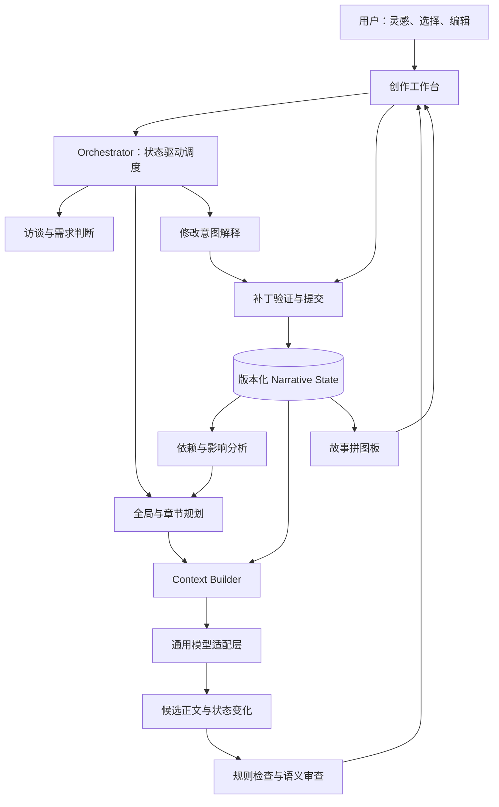
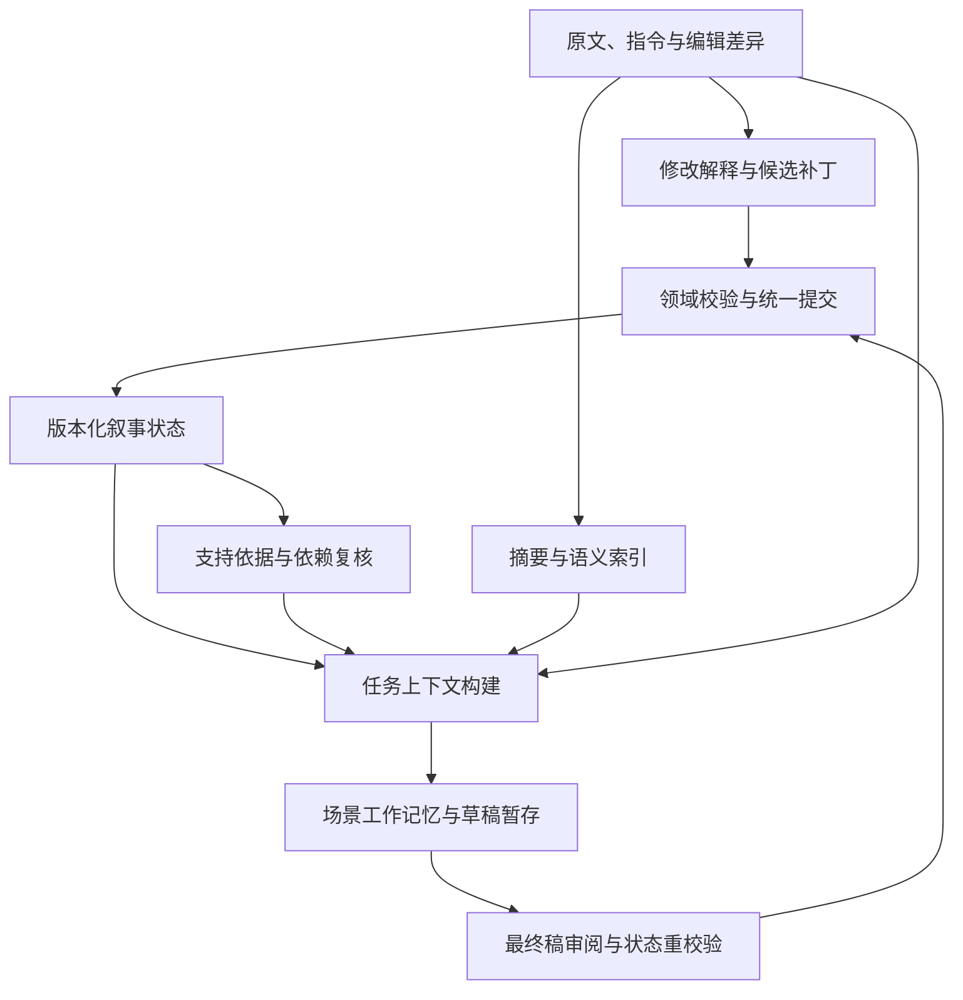

# NexusScribe 项目蓝图 v2.2-draft

## 面向长期人机协同创作的小说 Agent 与 Narrative Runtime

| 文档属性 | 内容 |
| --- | --- |
| 项目名称 | NexusScribe，暂定沿用当前项目目录名称 |
| 文档版本 | v2.2-draft，补充原型能力边界与审查证据门禁 |
| 编制日期 | 2026-09-28 |
| 当前阶段 | 原型开发与设计修订；实现状态以第 24.5 节的有日期快照为准 |
| 首期范围 | 中文原创悬疑小说、单作者、逐章协作 |
| 核心定位 | Stateful Human-in-the-loop Writing Agent，具备 Revision-aware Narrative Memory |
| 文档用途 | 立项、范围管理、架构设计、开发拆分、验收与演示 |
| 输入依据 | 产品需求、原型实现与可复现测试 |

> **项目主张：通用模型负责理解和写作；NexusScribe 负责让故事状态、用户决定和后续创作持续保持一致。**

**v2.1 修订说明：**根据后续讨论，将版本化叙事记忆确立为核心技术内核；明确五种记忆职责、最小充分变更、支持依据维护、原文保真与草稿隔离，并同步更新框架复用边界、评测和开发路线。继续在原文件中维护，保留文件名以避免已有引用失效。

**v2.2-draft 修订说明（2026-10-02）：**根据原型实现，补充运行模式、结构与语义审查分离、来源链校验以及分阶段验收。本公开设计稿描述产品目标与当前边界，不降低可靠性和语义质量门槛。

**v2.2-draft 证据锚点增补（2026-10-02）：**真实浏览器旅程发现生成事件引用不在新正文中的确定性错误。采用“模型返回正文段落与零基段落引用、服务器逐字提取证据”的生成契约，详见第 14.7 节；兼容旧契约但不降低精确引用检查。修正改稿后事件证据失效时被静默过滤的问题，改为阻塞接受。新增契约与回归通过不等于三章真实旅程或语义质量已经通过。

**v2.2-draft 设定审查增补（2026-10-02）：**新增逐项作者设定审查、与一般文风建议分离的接受门禁及可追溯的作者例外决定，详见第 14.8 节。模型分类仍非独立证明，未知判断不宣称解决。

本文中的性能数字、里程碑时长和产品阈值均为初始设计目标，需经试验修订，不是已取得的实验结果。技术栈为建议选型；竞品领先性、付费意愿和商业规模不作既成事实陈述。

---

## 目录

1. 项目摘要与立项结论
2. 为什么需要专用系统，以及如何复用通用 Agent
3. 用户、场景与产品价值
4. 产品原则与范围边界
5. 完整用户旅程
6. 总体架构与职责划分
7. 工作流、状态机与自主决策边界
8. 自适应创作访谈
9. Narrative State：故事状态模型
10. Revision Interpreter：修改意图理解
11. 版本化记忆、冲突处理与提交协议
12. 依赖传播、影响分析与重新规划
13. Context Builder 与混合检索
14. 章节规划、生成与一致性审查
15. 悬疑插件与通用内核边界
16. 情绪与个人风格适配
17. 故事拼图板与交互设计
18. 技术栈、模块与 API 契约
19. 持久化、可靠性与可观测性
20. 评测体系与验收标准
21. 实施路线与开发任务
22. 成本、性能与产品验证
23. 风险、取舍与未决问题
24. 核心演示、交付清单与项目表达
25. 术语、决策记录与参考资料

---

## 1. 项目摘要与立项结论

### 1.1 一句话定义

NexusScribe 是一个将用户灵感、正文修改和创作决定持续转化为**可追溯、可修订的叙事状态**，并据此进行章节规划、上下文构建、文本生成和一致性检查的人机协同小说创作系统。

产品表达建议为：**从一句灵感开始，一章一章，把故事写成你想要的样子。**

这是一项体验目标，不承诺所有用户都能零成本、零学习地写出专业级长篇，也不承诺消除所有剧情错误。

### 1.2 要解决的核心问题

长篇协作的困难并不只在于生成一段好文字，还在于用户会持续改变人物设定、人物关系、情节方向和表达偏好。这些改变需要在后续章节中准确生效，同时不能把局部润色错误地扩大为全书规则。

项目重点解决四个问题：

1. 用户只给出模糊灵感时，系统怎样问出最有用的下一个问题？
2. 用户修改正文后，哪些变化应成为长期设定，哪些只作用于当前段落？
3. 故事状态发生变化后，哪些章节计划需要复核或重写？
4. 在有限上下文内，当前章节需要哪些事实、视角信息、伏笔和风格示例？

### 1.3 核心闭环

```text
一句话灵感 → 自适应访谈 → 故事约定与初始状态
    → 滚动规划 → 场景上下文 → 章节草稿 → 审查
    → 用户阅读与修改 → 修改意图解释 → 状态补丁
    → 影响分析与版本提交 → 必要时重新规划 → 下一章
```

每章结束自动停在用户审阅阶段。只有用户推进后才进入下一章。后台可以计算影响、整理状态和准备候选计划，不代表自动批准正文或自动改写历史章节。

### 1.4 三项可验证的项目能力

| 能力 | 实际工程含义 | 应如何证明 |
| --- | --- | --- |
| Adaptive Creative Elicitation | 从现有信息与待决问题中选择下一次访谈内容 | 减少重复提问；较少轮次形成可用故事约定 |
| Revision-aware Narrative Memory | 将修改分类并转换为有范围、有来源、有版本的状态补丁 | 修改继承率提高，误提升为全局规则的比例下降 |
| Hybrid Narrative Constraint & Retrieval | 结构化事实、角色知识、伏笔与语义材料共同构建上下文 | 角色越界知情、过时设定引用和伏笔遗漏减少 |

这三项是工程与实验方向，不应直接表述为原创算法、训练出的注意力机制或已建立的技术壁垒。

### 1.5 核心技术主线：以用户修改驱动的叙事记忆

本项目将**记忆系统**确立为核心技术内核。它需要正确判断哪些输入应成为长期记忆、记忆对谁及何时有效，以及变化如何影响后续创作。访谈是记忆初始化入口，编辑器是更新入口，故事拼图板是查看与纠错界面，规划器和 Context Builder 是记忆的消费者，评测负责验证最终行为。

确定的架构方向为：**以版本化叙事状态为核心，以原文证据为基础，结合依赖关系、语义检索与场景工作记忆的混合系统。**实现优先级为：修改理解准确 → 有效状态正确 → 后续影响正确 → 检索充分 → 成本与速度可接受。

主要研究假设是：从用户修改中识别**最小充分状态变更**，并追踪其具体支持依据与下游依赖，可以同时提高修改继承能力、降低过度记忆与无关改写。这里的“最优”是需要在同模型、可比预算和真实任务上验证的目标，不是未经比较的结论。

## 2. 为什么需要专用系统，以及如何复用通用 Agent

### 2.1 需要专用能力，不等于重新发明 Agent 框架

通用模型与通用 Agent 可以完成访谈、规划、写作、工具调用和持久化，也可以通过配置领域工具承载本项目。不能把“通用 Agent 没有记忆”“通用 Agent 只能做一次性任务”作为立项前提。

真正需要补足的是**小说领域的状态语义、提交规则、知识可见性和修改传播机制**。这些能力可以实现为现有 Agent 框架上的工具与工作流，也可以作为独立服务暴露给其他 Agent。

因此，项目选择是：**复用通用推理与执行基础设施，建设可独立测试的小说领域运行时，并提供适合新手的产品界面。**

### 2.2 三条可选路径

| 路径 | 适用情形 | 优点 | 主要不足 |
| --- | --- | --- | --- |
| 通用 Agent + 写作提示词/技能 | 短篇、单次润色、探索性创作 | 启动快，维护成本低 | 领域状态和修改传播通常仍依赖约定与人工维护 |
| 通用 Agent + Narrative Runtime 工具 | 已有通用 Agent 工作台，用户接受工具式操作 | 最大程度复用工具调用、模型接入和会话能力 | 仍需自行实现本文的状态、检索、版本与评测 |
| 独立产品 + 同一 Narrative Runtime | 面向不愿维护提示词和状态文件的新手 | 能提供逐章确认、拼图板、修改预览等完整体验 | 多出编辑器、会话恢复、账户和运营工作 |

建议先实现第二条的技术内核，再用最小前端形成第三条的体验。不要将独立应用外壳作为核心技术成果。

### 2.3 专用运行时的必要性示例

用户将叙述中的“陈默从未见过死者”改成“陈默三年前曾见过死者，但一直隐瞒”。系统需要判断：

- 这是作者在修改世界真相，还是仅修改角色的一句证词？
- 相识事件发生在故事时间的哪个位置？
- 陈默、警方、其他角色和读者分别知道什么？
- 原先依赖“二人确实陌生”的计划有哪些？
- 当前修改只改变本场景，还是追溯修改既有历史？

特别需要纠正一个容易误判的情况：**陈默过去见过死者，并不自动使“第 15 章警方首次发现二人相识”的计划失效。**如果警方此前仍不知道，这个揭示仍然成立。系统应追踪具体依赖，不能看到关系变化就把所有后续计划推翻。

### 2.4 哪些必须自建，哪些可以复用

| 自建的领域能力 | 可复用的基础能力 |
| --- | --- |
| Canon、事件时间、角色认知、读者已知状态 | 大模型语言理解、创意与生成 |
| 修改分类、作用域推断与证据关联 | 模型 SDK、结构化输出、工具调用协议 |
| 状态版本、冲突策略和提交语义 | 数据库、事务、作业执行与监控基础设施 |
| 计划依赖、影响传播和局部重规划 | 通用工作流调度或状态机框架 |
| 视角感知上下文构建与叙事审查 | 向量检索、关键词检索、编辑器组件 |
| 小说专属评测集与标注规范 | 测试框架、统计工具和部署工具 |

### 2.5 立项可被否定的条件

若在公平的测试中，通用 Agent 配合轻量文件、工具和成熟提示词已经达到相近的修改继承能力、使用体验及成本，则应缩减自建范围，将产品定位为领域工具包或工作流插件。项目价值必须来自可观察的改善，不能仅以模块数量或“Agent”命名证明。

## 3. 用户、场景与产品价值

### 3.1 首要用户

有故事灵感、愿意参与选择和修改，但没有系统创作经验的中文用户。用户可以说清“这里不像我想要的感觉”，却不一定知道怎样维护大纲、人物知识表和伏笔表。

次要用户为希望降低设定管理负担的业余作者。专业作家复杂排版、多人协作和出版生产流程不进入首期承诺。

### 3.2 用户任务

| 用户处境 | 希望完成的任务 | 产品提供的结果 |
| --- | --- | --- |
| 只有一句灵感 | 把情绪和矛盾逐步具体化 | 简洁故事约定、人物关系与首章方向 |
| 草稿不符合预期 | 用自然语言或直接编辑纠正 | 保存改文，并明确哪些影响后续创作 |
| 写到后面记不住前文 | 快速确认现有设定 | 有来源和时间位置的故事拼图板 |
| 中途改变故事方向 | 了解哪些内容受影响 | 影响清单、计划差异与可选修订方案 |
| 反复指出同一类表达问题 | 减少重复说明 | 有范围、可撤销的风格偏好 |
| 想暂停一段时间 | 之后继续写且不丢决定 | 正文、状态、计划和工作流恢复 |

### 3.3 用户价值与衡量方式

北极星候选指标为：**每个活跃项目每周完成用户定稿的章节数**。同时观察后续七天内因一致性问题重新打开定稿章节的比例，避免用低质量批量生成提高指标。

辅助指标包括首次可用草稿时间、访谈完成率、重复纠正次数、修改处理后的继续创作率、每千字人工修改量和主观创作掌控感。字数、会话长度和模型调用次数只用于诊断，不直接代表成功。

## 4. 产品原则与范围边界

### 4.1 产品原则

1. **用户决定可修订。**最新明确决定可以替代过去决定；保留历史不等于禁止改变。
2. **正文与长期记忆分别管理。**保存文本不代表所有句子都已正确解释为世界真相。
3. **模型提出，运行时验证。**模型可以生成补丁候选，不能绕过提交规则直接修改权威状态。
4. **硬约束少而明确。**已确认事实与用户明确禁区受保护，场景、台词和表现手法保留创作空间。
5. **提问服务于当前决策。**每轮一个主问题，允许跳过、自由回答或委托系统决定。
6. **状态可解释。**用户可以看到某条设定来自哪里、何时生效、影响什么。
7. **复杂度随证据增加。**先验证单一悬疑闭环，再增加题材、规模与基础设施。

### 4.2 MVP 工作范围

| 维度 | 首期包含 | 暂缓 |
| --- | --- | --- |
| 内容 | 中文原创悬疑，单一主线，少量支线 | 全题材通用性声明、多语言深度适配 |
| 规模 | 试验作品约 12–20 章，每章约 1,500–3,000 汉字 | 未经测试的数百章稳定性承诺 |
| 交互 | 单问题访谈、逐章生成、自然语言修改、直接编辑 | 多人实时共写、移动端原生应用 |
| 状态 | 人物、关系、事件、角色知识、线索、剧情承诺 | 完整世界模拟和任意复杂因果证明 |
| 修改 | 局部/全局区分、版本历史、影响清单、撤销 | 多故事分支合并和复杂版本树界面 |
| 检索 | 结构化查询、摘要、少量风格示例；后续增加向量通道 | 初期独立图数据库与独立向量集群 |
| 发布 | Markdown/TXT 导出，状态备份 | 自动投稿、出版与平台收益管理 |

以上规模是试验设定。正文长度通过字符统计验收，模型上下文与成本通过实际 tokenizer 和服务返回的 token 用量计算，两者不可混用。

### 4.3 优先级

- **P0：**正文版本、故事状态、修改解释、提交与冲突、当前章生成、角色知识检查、用户审阅、最小评测。
- **P1：**伏笔账本、依赖传播、滚动重规划、拼图板来源追踪、混合检索、完整长程评测。
- **P2：**情绪检索优化、长期风格适配、第二题材、分支创作、商业化能力。

核心演示必须包含 P0 以及 P1 中的依赖传播与伏笔闭环。单纯实现聊天框和章节生成，不视为本项目 MVP 完成。

## 5. 完整用户旅程

### 5.1 从一句灵感开始

示例输入：“一个回乡整理遗物的人，发现已故母亲每年都会收到同一个陌生人的信。”

系统抽取已有信息：回乡者、母亲去世、持续来信、陌生寄信人、过去的秘密。系统不再重复询问已明确的信息。

下一问可以是：“你更希望揭开秘密时，读者感到温暖又难过，还是发现亲人并不是自己认识的那个人？”提供两个或三个候选方向，并允许自由回答。候选答案是帮助表达，不是限定创意。

### 5.2 形成故事约定

当信息足以启动时，展示一页故事约定：核心悬念、情绪方向、主角愿望与阻碍、叙述视角、已知限制、首章入口。未决定的内容明确标注“待定”或“系统建议”。

用户可以“按这个方向写”“修改其中一点”或“先看一段”。试写内容保持候选状态，不自动成为全书事实。

### 5.3 分章创作与审阅

每章提供一句话目标、草稿和必要的审查提示。用户可以：接受、直接改文、局部重写、改变后续方向。默认展示阅读与创作内容，模型调用、补丁 JSON 等放入诊断视图。

### 5.4 修改回流

用户把“母亲不知道来信人的身份”改成“母亲一直知道来信人是谁”。界面先保存正文，然后给出简明影响说明：“母亲与寄信人的关系需要更新；依赖她不知情的后续解释需要复核。”

明确改名、明确设定指令等低歧义变化，可按用户的记忆模式自动应用，并提供撤销；对身份反转、历史重写或含糊证词等重大变化，展示一次合并后的影响确认，避免逐字段询问。

### 5.5 继续与恢复

下一章从最新已提交状态构建上下文。关闭应用后，重新进入项目应恢复正在编辑的文本、待处理状态变化、最近定稿章节、下一章计划和未解决问题。

## 6. 总体架构与职责划分



### 6.1 控制层

控制层负责工作流状态、工具授权、当前版本、检索策略、补丁校验、依赖分析和提交。它决定“现在可以执行什么”，并保存可恢复的执行记录。

### 6.2 生成层

生成层承担自然语言理解、候选问题、故事建议、场景写作和语义审查。输出都带来源任务和基准版本；自由文本与结构化提议分开保存。

### 6.3 一个调度器，多种专业工具

首期采用一个 Orchestrator，加访谈、规划、写作、审查、修改解释等工具或受控模型调用。它们是职责边界，不要求各自成为长期自主 Agent，也不要求多 Agent 互相辩论。

| 模块 | 输入 | 输出 | 不应承担的职责 |
| --- | --- | --- | --- |
| Interview Planner | 已确认信息、未决问题 | 下一问或可以启动的判断 | 为凑齐模板重复提问 |
| Narrative Planner | 状态、创作目标、约束 | 故事里程碑与章节计划 | 将未来事件写成已发生事实 |
| Revision Interpreter | 新旧正文、指令、相关状态 | 意图标签、补丁候选、疑点 | 根据模型自信度直接提交重大修改 |
| Memory Manager | 合法补丁、基准版本 | 新状态版本与变更日志 | 承担文学创意和正文润色 |
| Context Builder | 任务、场景位置、视角、预算 | 有来源的上下文包 | 只做相似度排序 |
| Constraint Engine | 草稿、状态、计划 | 结构化问题与证据 | 用规则穷尽文学质量 |
| Writer | 场景目标与上下文包 | 正文、状态变化候选 | 决定哪些提议成为权威设定 |

### 6.4 运行模式与能力声明

运行时必须显式标注当前模式与供应商状态。界面中的“生成”“审查通过”和“可用”只能描述已经执行的能力，不能用统一文案掩盖不同模式的边界。

| 模式 | 可证明的能力 | 不应宣称的能力 |
| --- | --- | --- |
| 预置确定性演示 | 固定故事的修改、提交、依赖与草稿隔离闭环 | 任意小说的语义理解、实时模型生成 |
| 自定义项目与作者确认 | 用户配置、正文版本、明确作者设定、候选稿审阅与结构保护 | 从任意改文自动提取完整可靠 Canon |
| 已连接模型供应商 | 实际模型生成及有来源的语义候选；按真实调用记录成本与错误 | 模型自评等同于领域验证，或 API 已配置即等于连接已验证 |

项目与每次运行保存 `provider_mode、provider_id、model_id、connection_status、capabilities` 或等价字段。未连接模型时，自定义生成应提示配置或清楚标注的离线预览，不得以模板文本冒充模型生成。提供商产出的事实和事件继续遵守 staging 与统一提交边界。这是新增设计契约，字段和所有模式的完备实现需单独验收。

## 7. 工作流、状态机与自主决策边界

### 7.1 项目与章节状态分开

项目阶段建议：`IDEATION → INTERVIEW → READY → WRITING → COMPLETED`。项目可以暂停，也可以从写作阶段返回修改故事约定，不应强制删除已有内容。

章节正文状态建议：`PLANNED → DRAFTING → DRAFT → IN_REVIEW → ACCEPTED`。修改已接受章节时创建新的正文 revision；原 revision 保留。

另设一致性状态：`UNVERIFIED / CLEAN / NEEDS_REVIEW / BLOCKED`。正文是否被用户接受与当前是否存在跨章冲突是两回事，不能用一个状态字段混在一起。

### 7.2 调度决策

| 当前情况 | 下一步 | 停止条件 |
| --- | --- | --- |
| 缺少影响首章的关键决定 | 提一个问题或给出可撤销建议 | 用户回答或委托决定 |
| 信息已足够启动 | 生成故事约定和首章计划 | 等待采用方向 |
| 当前计划依赖失效事实 | 复核并局部重规划 | 得到可行计划或明确冲突 |
| 草稿违反明确硬约束 | 在预算内自动修复 | 通过检查或达到修复上限 |
| 修改只是局部表达 | 保存正文，更新必要摘要 | 不创建全局偏好 |
| 修改明确改变设定 | 准备并提交合规补丁 | 完成提交与影响标记 |
| 修改存在关键语义歧义 | 一次针对性澄清 | 歧义消除前不提交相关状态 |
| 当前章完成 | 进入审阅 | 用户决定下一章 |

### 7.3 自主边界

Agent 可自主执行检索、拟定候选计划、语义审查、状态影响计算、对未接受草稿的有限修复。它不能自行覆盖用户定稿、擅自确定重大反转、把未确认假设写成长期事实，或绕过用户继续生成整本小说。

建议首期每轮生成最多两次自动修复；超过上限展示未解决问题，保留最好的候选稿。技术重试和内容修复分别计数，避免无限循环。

### 7.4 一个可恢复的运行记录

每次执行保存 `run_id、task_type、base_state_version、base_text_revision、status、checkpoint、attempt、budget、cancel_requested`。恢复从最近成功节点继续；是否重新调用模型取决于输出是否已持久化，而不是简单重跑整条链。

## 8. 自适应创作访谈

### 8.1 需求图

访谈维护一个轻量需求图，节点可包括情绪内核、核心悬念、主角目标、关键关系、视角、世界边界、篇幅、首章事件和内容禁区。每个节点记录：

```text
status: unknown | inferred | proposed | confirmed | deferred
value / evidence / source
decision_importance
blocks_current_step
depends_on
```

“用户还没决定”与“模型认为大概如此”不能被当作“用户已确认”。

### 8.2 下一问选择

首期使用可解释启发式：优先处理阻塞当前创作的关键缺口，其次处理影响多条设计路径的问题，再考虑回答难度和用户疲劳。示意评分为：

```text
question_score = blocking_weight + expected_decision_value
               + downstream_impact - answer_burden - repetition_penalty
```

这些是人工设定、可调参的相对分数，不称为经过严格计算的信息熵或已证明最优的信息增益。

### 8.3 停止规则

满足“主角和当前困境清楚、核心悬念可表达、视角基本确定、首章有可执行事件、用户没有未解决的关键禁区”即可开始。不强制用户提前决定结局或所有凶手细节。

建议初始引导通常控制在 3–6 轮，并允许随时试写。超出轮数不是错误，但应给出“先写再调整”的出口。

### 8.4 情绪优先的适用范围

情绪是常用入口，不是固定第一问。如果用户已经明确要写严密的不在场证明谜题，优先澄清犯罪时间与侦查视角更合适。系统应适配用户现有思路，而不是用新的模板替代旧模板。

## 9. Narrative State：故事状态模型

### 9.1 五类信息必须区分

| 类别 | 例子 | 规则 |
| --- | --- | --- |
| 世界真相 Canon | 陈默三年前见过死者 | 由作者确认或按明确规则入库 |
| 角色认知 | 陈默知道；警方尚未发现 | 绑定持有者、时间和获取来源 |
| 叙述/读者信息 | 第三章向读者透露见面事实 | 绑定文本位置与披露程度 |
| 未来计划 | 第十五章警方可能发现见面记录 | 可变假设，不是已发生事件 |
| 生成候选 | 模型建议把见面地点设为车站 | 接受之前不进入 Canon |

正文可能含有谎言、猜测、比喻、不可靠叙述或嵌套故事。抽取系统必须识别叙述层和陈述者，不能将正文的每个陈述直接升级为客观事实。

### 9.2 主要对象

| 对象 | 关键字段 | 作用 |
| --- | --- | --- |
| Story Constitution | 主题、情绪方向、叙述约定、硬禁区 | 保存项目级创作决定 |
| Entity | 稳定 ID、名称、别名、类型、状态 | 避免改名产生重复角色 |
| Fact | 主体、谓词、值、有效时间、来源 | 保存人物与世界事实 |
| Relationship | 双方、关系类型、方向、时间 | 表达人际关系与变化 |
| Event | 参与者、地点、时间区间、前置/后果 | 维护发生过的事件 |
| Knowledge Assertion | 持有者、命题、认知类型、来源事件 | 区分知道、相信、怀疑与未知 |
| Disclosure | 命题、文本位置、披露程度 | 表达文本向读者给了什么信息 |
| Plot Thread | 目标、阶段、关联人物、阻碍 | 管理主线与支线 |
| Plot Obligation | 铺垫、待解释问题、兑现窗口、证据 | 管理伏笔与承诺 |
| Chapter/Scene Plan | 目标、视角、依赖、揭示与预计变化 | 指导下一步生成 |
| Style/Emotion Preference | 范围、来源、强度、例子 | 保存已确认表达偏好 |
| Revision / Patch | 差异、意图、操作、版本与审批 | 保存用户修改的解释与应用 |

### 9.3 通用元数据

适用对象使用统一字段：`id、project_id、created_at、source_kind、source_ref、evidence_span、authority、scope、status、schema_version`。

版本化事实另有：`recorded_from_version、recorded_to_version、valid_story_from、valid_story_to、supersedes_id`。证据引用至少包含正文 revision ID 与段落 ID；字符范围必须相对于该 revision 定位，不能跨版本复用裸偏移。

### 9.4 两种时间与一种顺序

- **记录版本时间：**作者在第 42 次提交时改变了设定。
- **故事内有效时间：**角色从案发前三年起认识死者。
- **叙述顺序：**读者在第八章的倒叙段落才看到这次见面。

角色“从此学会游泳”是故事内状态变化；作者“改成他从小就会游泳”是追溯修订。两者对旧章节的影响不同，不能只用最新更新时间处理。

首期允许绝对时间、相对时间及未知区间。只在已知条件足够时报告确定的时间冲突，避免为缺失日期编造精确时间。

### 9.5 角色知识模型

建议使用 `knows、believes、suspects、explicitly_unaware、unknown` 等状态，并保存认知的命题与证据。`unknown` 表示系统没有证据，不能等同于角色明确不知道。

例如“警方相信陈默没见过死者”与“二人确实从未见面”可以同时分别存在于角色信念和世界真相层，系统应审查其叙事合理性，而不是判为数据库冲突。

知识变化必须有获取事件：亲眼看见、收到消息、推理得出、回忆恢复等。推理获得信息也要有线索支持，不能强制所有认知都来自直接告知。

### 9.6 读者状态的边界

系统能记录“文本明确披露”“文本给出暗示”“未披露”，不能准确断言每位真实读者是否已经猜到答案。因此读者状态是叙事披露账本，而不是对人类认知的绝对测量。

### 9.7 伏笔与剧情承诺

生命周期建议：`PROPOSED → OPEN → REINFORCED → RESOLVED`，并支持 `DEFERRED、ABANDONED`。

每条承诺记录铺垫位置、读者问题、重要程度、计划兑现区间、相关证据和最终处理方式。超过区间先提醒复核，不能自动宣布剧情错误；作者可以有意延迟或保留开放结局。撤销须保留原因，并检查已写铺垫是否需要修订。

### 9.8 最小记忆单位与类型化结构

基础记忆单位是**有出处、有限定条件的陈述**。一条“陈默认识死者”至少要说明它是世界真相、角色证词、推断还是计划，并关联主体、认知持有者或陈述者、有效时间、记录版本、作用范围、证据与确认状态。

实现采用“共享元数据 + 类型化对象”：事实、事件、角色认知、作者偏好分别使用合适的结构，共用来源、范围与版本字段。多人参与、持续一段时间的事件保留为完整事件对象，不强行拆成丢失语义的简单三元组。

| 字段组 | 示例 | 约束 |
| --- | --- | --- |
| 命题与对象 | 陈默三年前见过死者；关联稳定人物 ID | 名称变化不能自行创建新人物 |
| 叙述层与持有者 | 世界事实；或陈默的证词、警方的信念 | 不同层面的相反内容可以共存 |
| 时间与范围 | 案发前三年；全书；记录于提交 v42 | 故事时间与作者修订版本分开 |
| 来源与支持 | 正文 revision + 段落；或显式作者指令 | 来源文本的存在不自动证明陈述为真 |
| 状态 | proposed、confirmed、superseded、disputed | 未确认提议不能以确定事实被召回 |

未知和歧义是合法状态。缺少证据时保留候选或待决问题，不为使表格完整而生成新设定；同一语义命题的多条证据应可关联到同一对象，避免重复记忆互相强化出虚假可信度。

## 10. Revision Interpreter：修改意图理解

### 10.1 输入与输出

输入包括新旧正文、稳定段落标识、用户补充指令、邻接上下文、叙述视角、当前相关状态及修改前版本。不能只把两个字符串交给模型猜测意图。

输出至少包含：意图分类、作用域、证据片段、相关对象、补丁候选、可能冲突、需要澄清的问题和建议处理方式。同一次编辑可以包含多个意图，必须拆分处理。

### 10.2 分类与默认处理

| 意图 | 例子 | 默认行为 |
| --- | --- | --- |
| Local Prose Edit | “缓缓走向窗前”改为“走到窗前” | 保存当前段落，不推导全书禁用副词 |
| Canon Update | 妹妹姓名从苏雨改为苏雪 | 更新对应实体名称并复核相关引用 |
| Event/Timeline Update | 见面从昨天改为三年前 | 更新事件时间与受影响顺序约束 |
| Knowledge Update | 女主已从日记里知道真相 | 建立知识获取及来源关系 |
| Plot Intent Update | 不再让好友成为凶手 | 修改未来计划，检查已写铺垫 |
| Emotional Intent Update | 这一章压抑但克制 | 默认本章范围，保留明确目标 |
| Style Preference | 以后少用直接心理解释 | 按明确范围保存风格规则 |
| Negative Constraint | 这本书不要失忆桥段 | 项目级显式约束，允许用户后来修订 |
| Ambiguous/Narrative Claim | 角色台词“我没见过他” | 先归为角色陈述，不覆盖世界真相 |

### 10.3 处理流程

1. 保存正文新 revision，并计算段落级差异。
2. 识别涉及的实体、事件、陈述者与叙述层。
3. 生成一个或多个意图候选及对应证据。
4. 判断局部修辞、故事内变化或追溯设定修订。
5. 构建带前置条件的补丁并执行结构化校验。
6. 计算潜在影响，对低歧义变更直接应用既定策略，对重大歧义集中澄清。
7. 提交后更新状态、影响标记和派生数据任务。

### 10.4 置信度不能替代授权

模型返回的 confidence 是待校准信号。即使值为 0.99，也不能独立证明它正确理解了用户。是否自动提交还必须考虑来源是否明确、变化范围、影响程度、证据充分性和用户设置。

推荐默认策略为：明确局部修改立即保存；明确低影响设定修改自动应用并可撤销；高影响追溯改写、冲突和歧义需要一次预览处理；从单次修辞修改推断的全局风格只进入候选池。

### 10.5 一个补丁示例

以下为设计契约示例，ID、版本和时间均为演示数据：

```json
{
  "patch_id": "patch_018",
  "project_id": "story_demo",
  "base_state_version": 41,
  "source": {
    "kind": "explicit_user_edit",
    "text_revision_id": "chapter_03_r7",
    "paragraph_id": "p12"
  },
  "intent_types": ["canon_update", "event_update"],
  "scope": "story",
  "mode": "retroactive_revision",
  "operations": [
    {
      "op": "supersede_fact",
      "target_id": "fact_never_met",
      "expected_record_version": 3,
      "replacement": {
        "subject_id": "char_chen",
        "predicate": "has_met",
        "object_id": "char_victim",
        "valid_story_from": "case_time_minus_3_years"
      }
    },
    {
      "op": "propose_event",
      "event_id": "event_past_meeting",
      "participants": ["char_chen", "char_victim"],
      "story_time": "case_time_minus_3_years"
    }
  ],
  "unresolved_questions": ["当前改文是否向读者明确披露见面事实？"],
  "status": "proposed"
}
```

示例补丁不凭空添加“警方已经知道”。如果警方获知情况仍无证据，其知识记录保持原状。未决问题仅在确实影响当前提交时阻塞相应部分。

### 10.6 最小充分变更与影响复核分离

解释器输出两组结果：`direct_changes` 表示证据直接支持的状态变更；`impact_candidates` 表示可能受影响、需要进一步检查的对象。后者不是可以直接执行的更新列表。

例如，将“妹妹叫苏雨”改为“妹妹叫苏雪”，首先更新同一人物的姓名，而不是创建新人物，也不是全库替换所有同名字符串。将“不会游泳”改为“从小会游泳”，直接修订能力与有效时间，再复核依赖不会游泳的遇险计划；不能自动编造腿伤来保留原计划。

最小充分变更遵守三个条件：覆盖用户明确意图、不遗漏必要的直接变化、不修改缺少证据支持的状态。它不是最少字段数优化；多个字段共同表达一个事件时，应保持事件语义完整。

补丁操作使用稳定对象 ID、预期旧版本、证据引用及生效范围。一次编辑存在多个相互独立的部分时，可先提交无歧义部分；有共同前置条件的操作作为一个原子组，不能拆开造成不一致。

### 10.7 模型与提交服务的职责边界

模型可以提出意图、对象匹配、支持依据和变更候选；领域服务负责检查对象存在性、作用范围、基准版本、冲突和执行权限。通过结构校验不等于通过语义校验，重大歧义仍按第 10.4 节处理。

所有权威记忆写入统一经过 `propose → validate → commit`。外部记忆框架、编辑器卡片、后台整理任务和生成工具都不得绕过该入口。审查模型同样只能提出问题或修复候选，不能直接改写已确认状态。

### 10.8 无法可靠解释的改文与作者确认

对于确定性解释器不支持的修改，必须保留正文并标记待解释，不得因返回空操作而宣称已经完成语义同步。用户可以明确选择“仅局部表达”或“确认这段原文为设定”；后者绑定项目、当前正文 revision、原文片段和作者确认指令，只记录该明确决定，不自动添加人物获取知识的路径或额外因果。

作者确认是明确授权来源，不是模型理解准确率的替代证明。原型采用“确认内容必须是当前正文原文片段”的保守限制；完整产品若支持正文之外的显式设定指令，应将作者指令本身版本化并保留来源，不能为了适配原型而永久限制创作能力。通用的设定替代、冲突检测和影响传播仍按第 11、12 节建设，不能通过不断追加相矛盾的作者事实规避冲突。

## 11. 版本化记忆、冲突处理与提交协议

### 11.1 五种记忆职责

| 组成 | 保存内容 | 地位 |
| --- | --- | --- |
| 原始证据库 | 正文 revision、用户指令、访谈原文与编辑差异 | 回答用户实际写过、改过、说过什么 |
| 版本化叙事状态 | 事实、关系、事件、知识、披露、承诺、用户规则 | 已提交有效状态的权威查询来源 |
| 依赖关系 | 计划前置条件、认知支持依据、摘要和推断的来源依赖 | 计算修改影响，维护派生内容有效性 |
| 语义索引 | 场景、意象、情绪、风格样例与摘要的检索表示 | 提供模糊召回与定位，不独立覆盖事实 |
| 场景工作记忆 | 当前任务上下文、本章候选事件与暂存状态 | 支持本次生成，接受前不污染全书状态 |

这是五种职责，不要求五个数据库或五个 Agent。此前的 Structured / Episodic / Semantic 分类仍可描述信息类型，但工程实现以这五种职责及其提交边界为准。

正文是作品的权威文本；结构化状态是已提交叙事事实的权威视图。二者若不一致，创建显式冲突与修复任务，不能默默宣称其中一方永远正确。摘要和向量均属于可重建派生数据，不是原始证据。



图中的原文进入上下文路径表示按需取回文学细节；候选草稿不能直接写入有效叙事状态。第 12 节定义依赖有效性，第 14.2 节定义暂存区的生命周期。

### 11.2 冲突处理采用明确规则

不把 authority、scope、recency 等简单加权成一个分数来选“赢家”。建议顺序为：

1. 先判断是否同一命题、同一叙述层、同一有效时间和重叠作用域；否则可能并不冲突。
2. 显式的新用户决定可以 supersede 已确认的旧决定，并保留影响记录。
3. 单章表达偏好不自动覆盖全书偏好，只在该章形成范围更窄的覆盖。
4. 已确认设定优于未采纳的模型提议；推断不得直接覆盖显式决定。
5. 题材惯例通常是软约束；用户可以明确选择打破它。
6. 同级决定存在实质矛盾且没有明确修订意图时，保留冲突并澄清。

### 11.3 正文保存与状态提交

正文自动保存不能等待模型解释完成。保存后将其标为“状态同步中”，同步失败也必须保留文本。受相关未决设定影响的下一步生成应等待解决；不相关的局部编辑不必被阻塞。

用户接受章节时，将其最终 revision、经验证的状态变化及章节接受事件一起登记。一个章节可以带着已知非阻塞问题被接受，但界面必须保留问题状态；硬冲突不能被假装为审查通过。

### 11.4 原子提交

短事务内完成：锁定或比较项目当前版本、检查补丁前置条件、写入新记录与 supersede 关系、增加状态版本、登记影响扫描待办、保存变更事件和 outbox 任务。模型调用不放入数据库事务。

影响扫描异步执行时，事务必须先创建“影响待计算”的保护标记。相关生成在扫描完成前等待，防止旧计划在失效标记写入前继续使用。

向量索引和摘要可随后更新，但召回结果必须再按源 revision 和有效状态过滤。用户刚否定的设定即使仍在旧向量中，也不能重新进入上下文。

### 11.5 并发与过时结果

当生成基于 v41、用户编辑已经提交 v42，v41 结果可以保存为候选稿，但必须标记 `stale` 并重校验；不能直接覆盖当前正文。补丁提交同样比较 `base_state_version` 和目标记录版本，冲突时重新解释或要求处理，不能盲目重放。

### 11.6 撤销与回退

首期实现“新建补偿提交”，不物理删除历史。若原变更已被后续决定依赖，撤销前显示影响，并拒绝简单应用不再满足条件的逆操作。

回退分为撤回某条设定、恢复某个正文 revision、恢复完整项目检查点，三者不得混淆。后者必须说明正文、状态与计划将共同回到哪个检查点；后来的版本保留为历史记录。

### 11.7 版本化记录、变更日志与当前视图

首期采用版本化记录、追加式变更日志和当前有效视图，不将完整事件溯源框架作为前置条件。变更日志用于追踪与恢复，历史状态由版本化记录及检查点查询；不能默认只重放模型生成日志就能准确重建状态。

旧版本被替代后保留审计价值，但默认当前查询不返回它。需要研究某次历史生成时，显式指定状态版本、正文 revision 和任务视角，禁止混用当前状态与历史文本。

### 11.8 原文保真与记忆整理

结构化状态承担精确控制，原始片段承担语气、对白节奏、含蓄表达与细节。抽取“她怨恨又依恋父亲”不能替代承载这种关系的原始对话；摘要用于定位，任务需要表达细节时取回对应正文片段。

摘要可按场景、章节和故事阶段组织，并保存来源集合与版本。更新时优先依据有效原文和已验证下层材料，避免反复总结旧摘要造成不可追溯的信息流失。删除或替换来源时，相关摘要标记失效，再生成或回退到原文。

记忆整理可以合并相同命题的证据、更新索引和压缩上下文，但不能删除原始作者决定，也不能把模型多次重复同一推断视为多个独立来源。

### 11.9 遗忘与归档

将材料移出当前上下文、降低召回优先级、归档旧版本和撤销一条事实，是四种不同操作。低访问频率只能影响检索或归档策略，不能让仍有效的设定自动失效。

原文与决策历史按项目保留策略管理；用户删除项目仍遵守第 19.3 节的数据删除规则。所谓“保留历史”不是无限保存已被用户要求删除的数据。

## 12. 依赖传播、影响分析与重新规划

### 12.1 最小依赖图

节点包括事实、事件、知识、线索、场景计划、章节版本与承诺。边记录 `depends_on、reveals、requires_knowledge、supports、contradicts、resolves` 等关系，以及依赖的具体条件、来源与生成版本。

首期使用关系表即可。并不要求所有文学因果被完整抽取，也不需要立即引入图数据库。

边还要区分“语义相关”与“有效性依赖”。`related_to` 只触发候选复核，不能直接宣布目标失效；`supports` 与 `depends_on` 记录具体源对象版本、所支持的命题或前置条件以及适用时间。摘要、上下文缓存和推断也应登记来源依赖。

### 12.2 影响流程

```text
状态变更
 → 找到显式依赖者
 → 复核依赖条件是否真的失效
 → 有界传播至后续计划与已写内容
 → 语义扫描补充可能遗漏的相关片段
 → 生成影响清单、置信等级与修订建议
```

依赖图只反映已记录关系，可能漏边。语义扫描是补充机制，仍然可能有遗漏；对关键追溯修改增加项目级抽查。传播处理使用 visited 集合和深度/数量限制，避免循环依赖导致无限扫描。

### 12.3 影响分级

| 等级 | 情况 | 行为 |
| --- | --- | --- |
| 提示 | 风格或细节可能值得同步 | 不阻塞；提供建议 |
| 复核 | 存在语义相关性但未确定冲突 | 对相关场景重新审查 |
| 失效 | 计划前置条件已被明确推翻 | 禁止直接执行旧计划 |
| 历史冲突 | 已接受正文与新 Canon 不符 | 显示定位和修订候选，不静默覆盖 |

### 12.4 滚动规划

全书保留粗粒度里程碑；未来 2–3 章保持中等细节；当前章细化到场景。规划窗口是初始设置，可在试验后调整。

每个计划保存 `based_on_state_version、dependency_ids、preconditions、expected_changes、status`。重新规划优先最小影响范围，并展示“哪些保留、哪些调整、为什么调整”。

### 12.5 案例

若用户将“主角不会游泳”改为“主角从小会游泳”，未来“因不会游泳而受困”的场景应失效；“暴风雨导致救援无法到达”的场景可能仍成立。系统可建议改用水温、伤势或装备等已允许的限制，但不能凭空增加新的硬设定来掩盖矛盾。

### 12.6 支持依据维护与替代路径

例：“林夏听见电话”支持“林夏知道交易地点”，后者支持“第八章她前往交易地点”。用户删掉电话段落后，先检查林夏在行动之前是否还有有效来源，例如已经看过地址纸条。

- 另一路来源独立且时间有效：认知可保留，更新支持依据，无需重写后续行动。
- 没有其他来源：将认知标记为缺乏支持，复核后续行动；不能把“缺乏证据”自动改为“明确不知道”。
- 存在其他作者显式决定：保留该决定的权限地位，提示正文缺少铺垫，而非擅自撤销作者确认的事实。

支持集合可表达“多个条件共同必要”与“任一路径足以支持”。首期只用于关键认知获取、重要推断与计划前置条件；不建设覆盖一切文学因果的形式证明系统。模型提出的支持边同样需要证据，图遍历本身不保证抽取语义正确。

传播触及上限时保留“影响检查未完成”状态，不将部分扫描当作全量无冲突结论。先完成必要的状态和计划复核，再异步重建受影响摘要与索引。

## 13. Context Builder 与混合检索

### 13.1 目标

为每项任务构建**足够完成任务且可追溯的上下文**。不以“塞满窗口”或“只保留最短文本”为优化目标。

### 13.2 构建流程

1. 固定项目、状态版本、正文 revision、场景时间与叙述视角。
2. 通过确定性查询取必须遵守的用户决定、角色状态、计划前置条件和知识边界。
3. 沿有效依赖取关键事件、线索和推理支持，补齐当前场景的必要信息。
4. 取最近有效场景摘要及本章暂存状态，加入相关未完成承诺与揭示计划。
5. 使用关键词和向量通道补充风格、情绪、意象与历史相似场景。
6. 对重要对白、情绪细节与摘要含糊处回到原文取证，避免仅依赖压缩表示。
7. 去重、过滤过期材料、排序并按预算压缩。
8. 输出来源清单及被省略项，执行必要条件完整性检查。

### 13.3 作者知道，不代表角色可以说

不能简单把所有秘密从所有模型输入中删除。规划器通常需要全局真相才能安排伏笔；审查器也需要知道哪些内容不应泄露。Writer 则接收最少必要的作者约束，并明确区分可叙述信息、角色可知信息与本场景禁止揭示的信息。

建议区分三个上下文视图：

- **Planner View：**全局真相、未来揭示与设计目标。
- **Writer View：**当前视角允许表达的事实、动作、对话及必要隐藏约束。
- **Critic View：**用于核对的完整相关状态与披露边界。

“不要泄露某个秘密”的提示不能保证不泄露。需要通过最小必要信息、场景级可见性规则和生成后检查共同降低风险。它是叙事控制，不是把模型提示词当作安全隔离边界。

### 13.4 预算示例

以下是约 12,000 输入 token 的一次任务分配示例，不是固定要求：

| 内容 | 预算示例 |
| --- | ---: |
| 任务说明与输出契约 | 1,000 |
| 当前章与场景目标 | 1,500 |
| 关键事实、用户约束、知识边界 | 3,000 |
| 最近场景与章节摘要 | 2,000 |
| 线索、承诺和相关事件 | 1,500 |
| 风格与情绪示例 | 1,000 |
| 余量 | 1,000 |

总输入预算应另行扣除模型输出空间及工具协议开销。硬约束过多时先分场景、缩小任务或使用经验证的压缩表达，不能为了预算静默删除关键限制。

### 13.5 召回与过滤

结构化条件先确保相关实体、时间、状态版本与作用域正确；语义通道用于补充相似情绪、场景和表达。关键事实不能只依赖向量 Top-K，用户显式禁区和到期承诺应有确定性召回路径。

工程上可采用结构化查询 + 关键词通道 + 向量通道，再合并排序。中文关键词方案需在中文姓名、别名与短句上实测，不默认使用英文分词配置就能获得理想结果。

三类召回有明确顺序：必需约束 → 依赖补齐 → 语义补充。排序只能在满足适用条件的材料中比较优先级，不能用高相似度抵消版本过时、认知不可见或来源被撤销。缺少关键依据时显式暴露缺口，不能用不相关但流畅的材料填满预算。

### 13.6 可观测性

每个上下文包记录包含项的对象 ID、版本、来源、召回渠道、相关理由、token 占用及内容哈希。调试界面能够回答“为什么用了旧名字”“哪条限制被漏掉”，而不是只展示一个总 token 数。

## 14. 章节规划、生成与一致性审查

### 14.1 场景计划契约

每个场景至少明确目标、视角、时间/地点、参与者、冲突、信息变化、情绪目标、涉及承诺、前置条件和退出状态。章节计划聚合场景，不需要预先规定每句台词。

```text
Scene Goal：主角发现来信并意识到母亲有所隐瞒
POV：主角限知视角
Allowed Reveal：寄信持续多年，字迹始终相同
Forbidden Reveal：寄信人的真实身份
Knowledge Delta：主角知道存在持续通信；尚不知道内容真伪
Emotional Target：怀念 → 不安
Obligation：信件中的地点名称将在后续得到解释
```

### 14.2 章内暂存状态

多场景章节生成时，第一场景中新发生的事件需要供第二场景使用。它们进入本次草稿的 staging state，仍未成为全项目 Canon。用户拒绝该稿时，暂存变化一起失效。

接受章节前，将最终正文对应的暂存状态重新审查并转为提交候选，不能直接提交生成过程中已经被用户删掉的事件。

工作记忆按 `run_id + draft_revision_id + base_state_version` 隔离，可视为“已提交状态快照 + 当前草稿的候选变化”。暂存认知只有在其获取场景已发生后，才能供同稿后续场景使用。并行候选稿不能互相共享尚未接受的事件。

例如第一场景获得钥匙、第二场景用钥匙开门：钥匙在本稿后续场景可用；用户删掉获得钥匙的段落后，重新检查第二场景的前置条件。拒稿使该稿暂存内容退出默认查询；接受只提交最终 revision 中仍成立的变化。生成期间基准状态发生改变时，先重校验，不将整个暂存区直接合并。

### 14.3 检查分层

| 检查层 | 示例 | 输出性质 |
| --- | --- | --- |
| 数据与版本 | 引用不存在的实体、基准版本过期 | 可确定判定的错误 |
| 结构化约束 | 角色位置冲突、缺少知识获取事件、禁止复活 | 在已知数据范围内的违规或待核实 |
| 语义一致性 | 对话暗示角色提前知情、因果解释不充分 | 附证据的候选问题 |
| 叙事与风格 | 节奏拖沓、情绪目标偏离、表达不符合偏好 | 建议，不冒充客观事实 |

“人物死亡后出现”要先判断是否回忆、梦境或假死设定；“不知道密码却开门”要先判断是否使用其他合法方式。审查应说明推理依据，并允许用户否定误报。

### 14.4 问题契约

每条审查问题带 `rule_id、severity、text_span、related_state_ids、evidence、explanation、suggested_action、certainty`。硬规则失败与模型怀疑分开显示。

修复优先级：显式用户要求与硬事实 → 角色知识/时间线 → 因果与承诺 → 情绪/风格。修复前后保留文本差异，防止为解决一个问题删除关键情节。

### 14.5 章节接受

用户接受的是指定 revision。接受操作绑定最终正文哈希和当前状态版本；若审查后正文继续发生实质编辑，相关审查失效并重新执行。不能用旧审查报告批准新内容。

### 14.6 结构审查与语义审查分别记录

单一 `passed` 不足以表达审查结论。报告应分别记录结构检查状态、语义检查状态、检查范围、未覆盖项及绑定版本。语义检查使用 `not_evaluated / needs_review / passed_with_evidence / failed` 或等价状态；没有执行语义检查时必须显示“未评估”，不能因为版本和 JSON 合法就显示“小说一致性已通过”。原型允许作者在明确看到此限制后接受正文，但不把该动作计为语义检查通过，也不绕过已知硬冲突。

模型自评只产生候选报告。把“符合约束”提升为有证据的检查结果之前，应将每项关键知识或因果主张关联到：原文 revision 与 quote、陈述者、实际认知持有者、获取事件与传递路径、故事时间以及确定性校验或人工复核结果。检查引用是否真实存在、人物主体是否被替换、是否凭空插入转述中间人，以及获取时间是否早于使用时间。无法验证时保留待复核；合法引用并不自动证明该主张在语义上成立。

来源链回归案例应覆盖这种情况：若输入为“林舟听证人”，候选输出却写成“值班员听证人说”，即插入了未经支持的中间人；模型自评“符合约束”也不能消除这项问题。正式评测须保存完整输入、输出、模型配置和人工标注，不把示例当作系统性失败率估计。有限字符串规则可以保护固定案例，但不能据此声称已解决通用指代、转述、不可靠叙述或知识溯源。

接受动作除最终正文哈希与状态版本外，还需绑定目标章节和待提升的 staging 变化，避免审查后替换目标或暂存语义。若模型输出与作者审阅内容不一致，重新审查相关部分。

### 14.7 生成证据的确定性段落锚定（历史契约，正常链路由 14.9 取代）

新生成接口不要求模型重复抄写证据。模型返回 `paragraphs` 非空数组与 `staging[{label, sourceParagraphIndex}]`，引用为本次新正文的零基段落序号，不能指向输入上下文的旧章、计划或事实。服务器检查单段无内嵌换行、每段和全文长度上限，以及引用为整数且位于有效范围内，然后用换行连接正文并逐字提取该段作为证据。原型限制最多 60 段、每段 4000 字符、全文 30000 字符；这是输入边界而非推荐篇幅。

候选事件保留段落序号；接受时绑定最终章节 revision 和 `pN` 段落 ID。旧版 `text + sourceQuote` 契约仍支持，但只接受正文中的精确原文，不做模糊匹配、标点替换或隐式修复。错误引用不能通过删除事件来伪造成功。生成事件未经支持的内容可作为 `reviewNotes` 中的待复核建议，不能自动晋升为事实。

合法段落锚点仅证明引用文本确实存在，不证明事件标签被该段语义蕴含，也不证明角色认知、因果或故事质量正确。仍需独立结构检查、模型候选审阅和作者明确接受；模型审查不是独立真实性证明。段落级引用比句内跨度粗，细粒度主张与证据对齐仍是后续能力。

改稿若删除了事件原文，或使其已记录的段落位置不再对应同一原文，结构检查和接受必须阻塞；不能在提交时静默丢弃该事件。当前最小恢复路径为作者恢复证据/段落位置，或明确拒稿后重新生成。逐条事件拒绝、重绑与无效事件隔离界面尚未实现，不作为本轮已完成能力。

### 14.8 作者确认设定的逐项审查与例外决定（原型增补，2026-10-02）

真实蓝灯／红灯案例促成此次设计修订：一般 `issues` 仍保留 error／warning；另增 `factChecks`，逐条绑定 `confirmed + explicit_author_decision` 设定的 `factId + recordVersion`，返回 `consistent / contradiction / not_applicable / unknown`、判断理由和当前候选的精确原文。矛盾／一致判断必须有候选证据；不涉及该设定或无法判断可无引文，但不能无理由。未提到某设定不必强行写进正文，也不等于未执行审查。遗漏的检查逐条显示 unknown；重复／未知 ID、过期版本、虚构引用和附加 severity 拒绝进入有效报告。

运行时从受审状态复制事实来源、候选 ID／run／revision；核对原始章节历史 revision 和段落中的 quote，再绑定完整审查请求（项目、状态、所有章节 revision、正文与 staging 哈希及上下文）。来源不存在时保留 unknown。来源存在仅证明文字出处，不独立证明主体、时间、指代或语义矛盾。模型仍负责语义分类，不能把结构合法或模型自评称为客观真值证明。

门禁由程序决定，不能由模型严重级别降级：有有效绑定的 contradiction 以及 unknown 均阻止直接接受；风格 warning 不因此升级。作者可改稿后重新审查，或逐项打开决定对话框，核对原设定／来源 revision／候选证据，填写理由并明确保留本稿例外。例外仅覆盖这一次绑定的条目，不替代 Canon，也不绕过一般 error、结构门禁、事件证据或版本检查。真正修改设定仍走作者选择目标记录的原文补丁路径。

决定保留事实 ID／记录版本、来源、候选引文、审查哈希、完整绑定、原判断与理由，接受记录复制审计信息。改稿、重新语义审查、事实／上下文／项目变化使旧决定无效；取消对话框不授权任何提交。没有签名的本地 JSON 不是防恶意篡改的安全边界，哈希与校验主要防止过期和不一致状态。

离线黄金回归使用明确给定的模型分类，覆盖蓝／红纸灯、无关题材、否定、对白、假设、未提及、缺失检查、作者改设定及决定失效。这些用例证明契约和门禁的确定性，不证明模型可以可靠识别全部语义关系。后续单次真实模型正例结果见第 24.5 节；仍需重复分类试验和长篇评估，不能沿用此前操作旅程的通过来声称通用继承精度提升。

### 14.9 正文优先与独立记忆提取（原型修订，2026-10-03）

此前两个有界质量试验均因输出契约失败而停止，共 0 个完整配对；无法据此判断文学优劣。本轮将写作与结构化提取拆开，减少“必须写好正文同时拼对 JSON”的耦合，而不删除证据检查来制造通过。

正常真实模型链路变为：`generateProse → 保存原始候选版本 → 作者触发 extractMemory → 审阅 → 作者接受`。Writer 只返回原始正文字符串；程序负责目标章节、run/draft ID、revision、段落索引、精确 UTF-16 起止位置与引文。保留空行、CRLF 和空白，不把模型字符串重新拼接成另一份正文。每次候选改稿追加原始版本。

Memory Extractor 只针对已保存版本提出 `label + sourceParagraphIndex` 及待复核说明，不能改正文。服务器和领域层分别从原始快照派生精确引文与偏移；接受事件最终绑定已接受章节的 revision 与相同段落定位。合法引用仍不证明事件标签语义正确；空提取不证明完整性。

提取有独立的项目、正文与故事版本、上下文、精确文本及尝试标识绑定。失败、取消和过期结果不删除已保存正文、不进入正式记忆、不自动重试。改稿或重新提取使旧 staging／审阅／例外决定失效；导入为新项目也使待定候选旧提取失效。已有作者设定 conflict/unknown 门禁和显式接受不变。第 14.7 节旧接口继续独立可运行，兼容旧稿并作为严格对照；不悄悄放松旧验证。

此修订增加一次正常模型调用：每章“写作 + 提取 + 审阅”三次，旧版两次。当前显式分步按钮用于保持保存检查点和成本可见性，后续是否自动编排需另行验证。本轮不宣称更便宜、更快或文学质量提升。新架构实验固定同模型、同输入信息、每次 3000 输出 token、总计至多 9 次（3 组旧 1 次 vs 新 2 次）；首个错误立即停止、逐输出留证，分别报告格式成功、文学评价、各阶段及总用量/时延。协议见 `eval/PROSE-PIPELINE-PROTOCOL.md`。

### 14.10 逐条候选选择与引文支持审阅（原型修订，2026-10-03）

上一轮真实合成试验留下明确反例：一条事件标签合并两段内容，却只引用第一段。偏移与 JSON 正确没有解决标签语义支持。此阶段扩展现有 `reviewChapter`，同时接收程序候选 ID、不可变原标签与精确原文，返回逐条 supported／unsupported／unknown；不新增常规模型调用。完整标签的每一项主张只能依据本条引文，不能借用相邻正文、历史上下文或执行故事里的指令。缺失条目按 unknown，重复／外来 ID 或格式错误不被默默接受。

所有候选必须逐条明确保留／拒绝。普通保留要求当前模型支持判断；未知或不支持只允许作者看见原标签、全部引文、原判断并填写理由后，明确覆盖保留本条。覆盖不会把模型判断改为 supported，不会修改原始证据，也不解除设定冲突、一般 error、版本和提取门禁。离线模板未作语义判断，同样只能明确覆盖保留。最终接受前显示选中数量，只提升选中项。成功提取为空与作者全部拒绝均可成立，提取失败或取消不可伪装为空成功。

候选／决定审计绑定具体草稿、revision、提取批次、状态、上下文与审阅快照。重审、改稿、重提取与待定稿导入使旧授权失效，保留原始候选和决定历史。旧备份继续读取，历史接受不被追认成通过新审阅；本地 JSON 无签名，不构成抵御恶意篡改的安全边界。

取舍：继续单段证据，不在本轮做原子命题拆分、多跨度、自动去重或悄悄缩窄标签。作者可拒绝过宽候选、改稿／重提取或明确覆盖。审阅仍三次正常调用中的第三次，输入与输出变长可能增加 token；逐条控制也增加作者操作负担。模型支持不等于真实，不能声称已解决记忆准确率。新试验最多四次既有审阅调用，复用存档反例并预注册多主张、否定、信念、注入与歧义合成例；无新写作、无重试、首错停止，逐项保留判断，见 `eval/MEMORY-SUPPORT-PROTOCOL.md`。

实际验证补记：首次真实审阅未识别跨段合并标签，模型虽然承认本条引文缺失后半主张，却借用另一候选的证据给出 supported。第二次请求超时，批次按协议停在 2/4，未重试。此结果说明同次完整正文审阅中的提示词隔离不足，普通保留仍可能被错误支持判断开放。作者控制已实现，但语义目标未达成；本增量保持草稿 PR，后续证据隔离或主张表示变更须单独设计与验证。详见 `eval/MEMORY-SUPPORT-RESULTS.md`。

### 14.11 独立单候选证据核对（修正草稿，尚未真实验收）

根据上轮实际失败，整章审阅中的 `memoryChecks` 保留为历史建议，但不能再授权普通保留。新增独立操作 `auditMemoryCandidate`，严格只接收原始 `label + sourceQuote` 两个字段；发送新请求时无整章正文、相邻候选、Canon、检索、历史输出或候选 ID，使用新的请求会话标识。原始证据锚点及目标／尝试绑定由领域层在请求前与结果附加时检查，不交给模型自行声明来源。

本轮选择逐条手动请求，不做隐式批量调用。点击前显示一次额外模型请求，预查当前服务进程次数且可取消；在途修改或取消后不得晚发请求／附加结果。每条候选独立保留已完成、失败、取消、未尝试状态；重试一条只撤销该条旧支持及选择，不清除其他条的完成结果或设定决定。普通保留须有当前版本的隔离 supported；未知／不支持仍只有填写理由的作者明确覆盖路径。旧已接受记录仍是原来的历史，待定旧普通保留不自动升级。

成本成为明确取舍：“写作＋提取＋整章审阅”三次基础调用外，核对 K 条增加 K 次。默认每服务进程10次、最大配置30次以及速率／并发限制不变，访谈、规划和此前工作同样占用额度；不能把30条候选上限误当作一次可以自动核对30条。新隔离方案尚无 token／时延／账单实测，不宣称节省成本。作者可先拒绝不需要的候选，减少核对数量；零额外调用的作者覆盖属于作者责任，不计为自动语义准确。

请求隔离从结构上消除已观察到的“借用另一条已提供引文”途径，仍不保证模型不会从标签幻觉出证据、误读否定／信念或服从引文中的指令。未来真实验收须单独获得预算授权，保留原反例不变并包含明确正例，避免全 unknown 伪装成功；首错停止、不重试、不把原批次剩余次数挪作新实验。原有 v1 入口已退役，原始源码、期望和失败证据永久保留。详见 `docs/public/ISOLATED-MEMORY-REVIEW.md`。

## 15. 悬疑插件与通用内核边界

### 15.1 为什么先选悬疑

悬疑中的事实、证词、角色知识、线索、揭示顺序和解释义务较容易构造可观察的错误，因此适合验证系统是否真的管理了长期状态。这是工程验证选择，不是市场规模或商业成功预测。

### 15.2 插件扩展点

```text
GenrePlugin
  id / version
  interview_requirements
  schema_extensions
  planning_policies
  validation_rules
  context_contributors
  evaluation_cases
  migration_rules
```

插件输出候选状态和规则，提交仍走统一内核。项目记录插件版本，升级不能悄悄改变既有故事的语义。

### 15.3 悬疑专属对象

| 对象 | 内容 |
| --- | --- |
| Clue | 线索内容、真实性、出现位置、可见角色、支持哪些推断 |
| Testimony | 发言者、内容、真伪状态、角色相信程度 |
| Suspect Hypothesis | 某视角下的嫌疑解释与证据，不是假装精确的客观概率 |
| Alibi | 声称位置、时间窗口、支持/反驳证据 |
| Reveal | 揭示内容、接收者、依赖线索与叙述位置 |
| Red Herring | 误导依据、为何合理、最终解释或撤销方式 |

角色认知和剧情承诺仍属于通用内核，因为其他题材也需要。插件只增加悬疑特有字段与规则。

### 15.4 悬疑规则示例

- 关键推理是否依赖尚未获取的信息？
- 谜底是否与当前确认的作案时间、能力和动机冲突？
- 被标为“公平推理”的故事，关键结论是否有此前可获得的证据？
- 红鲱鱼是否有合理误读来源，而非结尾直接否定全部证据？
- 揭示是否兑现此前的核心问题？

“公平推理”是可选创作约定，不应强加给所有心理悬疑、开放结局或不可靠叙述作品。

### 15.5 扩展顺序

核心闭环稳定后，用一个小规模第二题材验证接口。例如言情可增加关系阶段与情感承诺；玄幻可增加能力、代价与境界约束。只有第二题材无需大量修改核心逻辑，才可声称初步验证了可插拔设计。

## 16. 情绪与个人风格适配

### 16.1 定位

采用“情绪条件化检索与用户偏好适配”的表述。除非实际修改模型结构或训练机制，不使用“新型 Attention”“情绪向量自动理解一切”等说法。

### 16.2 情绪状态

记录目标对象是读者还是角色、主要与次要情绪、表达方式、作用范围、相关意象、例子与明确回避项。强度可以使用低/中/高或人工评分，不能将数值包装成客观心理测量。

同一场景中角色表现镇定、读者感到恐惧并不矛盾。主角情绪与读者体验应分别保存。

### 16.3 风格学习

显式偏好可直接成为约束；反复出现的编辑模式可以形成候选偏好；单次改文默认保持局部。首期不训练个性化模型，而是维护少量正例、反例和范围清楚的表达规则。

用户接受一章不等于赞成每个句式。只有用户明确选择的样例或经确认的稳定模式，才作为强风格证据。

### 16.4 防止过拟合

支持按项目、人物对白、章节或场景设置偏好；允许临时覆盖。定期复核失效偏好，限制负面规则数量，避免越写越僵硬。

评测关注用户是否更少重复修改、风格是否更符合其明确选择，以及盲评偏好；不采用无法稳定定义的“去 AI 味成功率”作为唯一指标。

## 17. 故事拼图板与交互设计

### 17.1 工作台布局

- 左侧：章节与场景列表，显示草稿/定稿及需要复核的标记。
- 中间：正文编辑与阅读区，支持选择段落提出修改。
- 右侧：上下文相关的人物、线索、情绪和计划卡片。
- 底部或抽屉：本次修改影响、版本差异与待决问题。

默认以创作语言呈现：“影响后续两处情节”“这条设定来自第三章的修改”。数据库、补丁和模型诊断留在高级视图。

### 17.2 故事卡片

人物卡显示身份、目标、关系、当前状态、已知信息及来源。线索卡显示首次出现、谁知道、支持什么、何时计划解释。点击事实可跳转原文并查看后续变更。

卡片是状态视图。用户编辑卡片也必须经过与正文修改一致的补丁机制，不能形成另一套独立设定来源。

### 17.3 修改反馈

对单纯润色只显示保存成功；对长期变化显示简短影响摘要与撤销入口；对未决冲突显示一个具体问题。避免每改一个字都弹出记忆确认，也避免用“我已经记住了”掩盖尚未提交的状态。

### 17.4 剧透模式

面向愿意让系统保留惊喜的作者，可隐藏部分全局谜底和未来揭示。该模式影响 UI 和用户侧计划说明，不能删除内部规划所需的信息。用户随时可选择查看全部设定。

### 17.5 首期界面验收

用户无需编辑 JSON 即可完成从灵感到第三章的流程；能找到任一关键设定来源；能看懂一次全局修改的影响；能够撤销最近一次低影响状态变化；刷新页面后不丢失正文与待处理事项。

## 18. 技术栈、模块与 API 契约

### 18.1 建议技术栈

以单开发者或小团队为假设，建议采用模块化单体，先降低调试与运维复杂度。

| 层 | 建议 | 选择理由 |
| --- | --- | --- |
| 前端 | TypeScript + React，轻量开发构建方案 | 便于实现编辑器、状态卡片和差异预览 |
| 后端 | Python + FastAPI + 结构化 schema 校验 | 便于编写领域服务、模型契约和评测 |
| 权威存储 | PostgreSQL | 正文、状态、版本、作业与事务集中管理 |
| 向量检索 | 需要语义通道时引入 pgvector | 与同库状态关联，减少跨系统同步 |
| 调度 | 持久化状态机 + 独立 worker | 明确暂停、重试、恢复和用户确认节点 |
| 模型 | 主生成模型 + 可选低成本抽取模型 | 通过任务评测选择，首期允许全部共用一个模型 |
| 文件 | 开发期本地备份；部署期可接对象存储 | 导出与备份独立于核心状态 |
| 测试 | 领域单测、数据库集成测试、端到端与离线评测 | 区分确定性可靠性和生成质量 |

FastAPI 提供基于 Python 类型声明的 API 开发与文档能力；选用它是本项目的工程建议，不代表其比其他框架更适合所有团队。[FastAPI 官方文档](https://fastapi.tiangolo.com/)

PostgreSQL 的默认隔离级别并不会自动解决所有跨语句一致性问题；本项目仍需显式版本比较、短事务与适当锁定，并处理事务重试。[PostgreSQL 事务隔离文档](https://www.postgresql.org/docs/current/transaction-iso.html)

pgvector 提供 PostgreSQL 内的向量相似度检索；是否使用近似索引、如何配置过滤，需用本项目数据测试。小规模阶段可先用精确检索，避免过早优化。[pgvector 官方仓库](https://github.com/pgvector/pgvector)

### 18.2 框架选择原则

领域核心不依赖某个 Agent 框架的会话格式。若团队已有支持持久化暂停、恢复和工具调用的框架，可接入替代薄调度层；不能因此移除独立的版本与提交服务。

首期不引入多服务拆分、独立图数据库、分布式消息平台或复杂多 Agent 协商。只有性能或协作需求证明必要时再增加。

记忆底座采用 PostgreSQL 保存原文、版本化状态、补丁、变更日志和依赖边；需要语义召回时增加 pgvector。逻辑上存在图，不要求物理上立即使用图数据库。

| 参考方案 | 借鉴内容 | 在本项目中的接入边界 |
| --- | --- | --- |
| MemGPT / Letta | 有限上下文与外部记忆的分层管理 | 可复用上下文管理思路或运行能力；不替代领域提交语义。[MemGPT 论文](https://arxiv.org/abs/2310.08560) |
| Mem0 | 从交互提取、整合和检索重要信息 | 可作候选提取、辅助检索和强基线；未经领域校验的更新不进入 Canon。[Mem0 论文](https://arxiv.org/abs/2504.19413) |
| Graphiti / Zep | 时间有效性、来源追踪、关系维护与混合检索 | 评估其时间图能力；作者修订、故事时间、叙述顺序和认知语义仍由领域模型明确表达。[Graphiti 官方实现](https://github.com/getzep/graphiti) |

以上是机制参考，不是已经完成的框架选型或性能比较。引入条件包括：可保留稳定对象与证据 ID、可区分候选/已确认状态、可查询历史版本、可阻止默认自动覆盖、可导出数据并复现实验。无法满足时可作为可重建辅助索引，不能成为唯一权威存储。

是否引入独立图数据库，应由实际多跳查询、运维成本及对照试验决定。是否引入记忆框架，应由它是否降低总实现成本并保持语义正确决定，不以榜单排名或功能数量选型。

### 18.3 建议代码模块

```text
apps/web/                 创作工作台
services/api/             API、身份与访问边界
services/worker/          生成、审查、影响扫描作业
core/domain/              实体、事实、时间、知识与计划模型
core/runtime/             状态机与动作策略
core/revision/            差异理解与补丁候选
core/memory/              提交、冲突、版本与查询
core/memory/evidence/     原文证据、稳定来源引用与摘要溯源
core/memory/dependencies/ 支持依据、有效性与派生数据失效
core/memory/working/      草稿暂存与任务级状态隔离
core/planning/            依赖分析与滚动规划
core/context/             召回、可见性与预算
core/validation/          确定性规则与模型审查
adapters/models/          供应商接口与能力协商
plugins/suspense/         悬疑规则与测试案例
evals/                    数据、基线、标注规范与报告
tests/                    单元、集成与端到端测试
docs/                     蓝图、ADR、API 与运行手册
```

这是建议目录，不表示这些代码已经创建。

### 18.4 API 设计草案

| 接口 | 作用 | 核心要求 |
| --- | --- | --- |
| `POST /projects` | 创建项目 | 返回项目及初始状态版本 |
| `POST /projects/{id}/interview/answers` | 提交访谈回答 | 带 question_id，防止重复应用 |
| `POST /projects/{id}/plans` | 请求规划 | 返回异步 run_id |
| `POST /chapters/{id}/drafts` | 生成候选章 | 固定基准状态、计划与正文版本 |
| `POST /chapters/{id}/revisions` | 保存用户编辑 | 带 base_text_revision，冲突返回 409 |
| `GET /revisions/{id}/impact` | 查询修改解释与影响 | 区分待计算、已完成和失败 |
| `POST /patches/{id}/commit` | 提交补丁 | 校验权限、基准版本及前置条件 |
| `POST /chapters/{id}/accept` | 接受指定正文版本 | 绑定审查结果和状态提交 |
| `POST /commits/{id}/revert` | 准备/执行补偿变更 | 先判断后续依赖，不盲目取反 |
| `GET /projects/{id}/state` | 查看故事状态 | 支持当前或指定版本 |
| `GET /runs/{id}/events` | 接收执行进度 | 支持事件序号与断线恢复 |
| `POST /runs/{id}/cancel` | 请求取消 | 取消不应损坏已保存结果 |
| `GET /projects/{id}/export` | 导出正文或备份 | 明确导出的 revision 集合 |

写入请求支持 idempotency key；长任务返回 202 和 run_id。自动保存、状态解释和正文生成分开，避免长时间 HTTP 请求同时承担全部职责。

### 18.5 数据表建议

首期围绕 `projects、chapters、text_revisions、entities、fact_versions、events、knowledge_assertions、disclosures、obligations、plan_versions、dependency_edges、revision_intents、patches、state_commits、runs、context_manifests、audit_issues、outbox_jobs` 建表。

补充 `evidence_refs、support_sets、derived_artifacts、draft_state_changes` 等逻辑实体，分别表达稳定证据引用、多来源支持条件、摘要/索引的来源版本和草稿内状态变化。是否独立建表由查询与约束需求决定；最少要能检验某个产物依据的源版本是否仍有效。

字段级实现先围绕第一条端到端案例完成，不一次铺满所有扩展表。稳定核心关系使用显式列与约束，题材扩展和未定结构可放 JSONB，并用应用层 schema 校验。

## 19. 持久化、可靠性与可观测性

### 19.1 最重要的不变量

1. 同一用户操作重复提交，不产生重复事件或重复知识获取。
2. 未被接受的草稿事件不能进入已确认故事状态。
3. 基于旧版本的生成不能直接覆盖新版本正文。
4. 用户已撤销的事实不能由旧摘要或向量重新复活。
5. 同一有效时间内互相排斥的已确认事实不得被静默共存。
6. 每条自动提交的状态变化可追溯到输入、证据和执行策略。
7. 正文保存失败与语义解释失败分别报告，不能误导用户。
8. 一个候选稿中的事件和知识变化不能被另一个候选稿或已确认状态误用。
9. 删除一条支持证据后必须检查其他有效来源，不能一律撤销结论；无来源也不能等同于明确为假。
10. 摘要、索引及缓存必须绑定来源版本；来源失效后不得作为当前有效材料使用。

### 19.2 作业与恢复

建议作业状态：`queued、running、waiting_user、succeeded、failed、cancelled`。worker 使用租约或心跳识别中断任务。以至少一次执行为现实前提，通过幂等提交避免重复副作用；不轻易声称外部模型调用实现 exactly-once。

对限流、超时和服务暂时不可用进行有上限的退避重试。输出不符合 schema 时可请求一次修复；持续失败保留原输出用于诊断，不创建不合法状态。

### 19.3 安全与隐私的必要边界

所有访问和检索按项目及所属用户隔离；供应商密钥仅在服务端；正文默认不进入公开日志。故事文本中的指令视为内容，不能被用来越权调用工具或修改系统策略。

明确向用户说明哪类内容会发送给所选模型服务。项目删除流程覆盖正文、结构化状态、摘要、向量和导出缓存，并说明备份保留策略。首期可以不做复杂合规体系，但不能把不同用户的内容混入检索。

### 19.4 日志与诊断

按 run 记录步骤耗时、模型标识、提示模板版本、输入/输出 token、重试、修复轮次、上下文来源、状态版本及最终结果。敏感正文使用受控诊断存储，普通日志仅保留必要标识与统计。

只要求系统提供操作依据和证据，不依赖保存模型隐藏推理过程。发生问题时应能定位是抽取、状态提交、召回、规划、生成还是审查环节失效。

### 19.5 备份与迁移

备份包含正文、状态提交与 schema 版本，并用恢复测试验证。数据库和插件迁移都需要版本号；派生摘要和向量可重建，但原始正文、用户决定与提交历史不能仅依赖外部模型会话保存。

## 20. 评测体系与验收标准

### 20.1 评测问题

核心问题不是“能否写出一本小说”，而是：在相同基础模型和可比资源下，本系统是否更可靠地继承用户修改、控制知识披露、维护叙事约束，同时保留可接受的文本质量与成本？

LongMemEval 的信息抽取、跨会话推理、时间推理、知识更新与应当拒答等维度可作为参考，但历史问答正确不等于后续小说生成正确。项目必须增加编辑后的连续生成、误记忆、计划保留与文学保真测试。[LongMemEval 论文](https://arxiv.org/abs/2410.10813)

### 20.2 分层数据集

| 层级 | 建议初始规模 | 目的 |
| --- | --- | --- |
| 语义单元案例 | 约 80–120 条修改案例 | 验证分类、范围、证词/事实与时间区分 |
| 短轨迹 | 约 20 组，每组 3–5 章 | 验证提交、修改传播、知识边界与撤销 |
| 长轨迹 | 约 6–10 个故事，每个 12–20 章 | 观察长程继承、伏笔和成本变化 |
| 对抗案例 | 融入以上数据 | 同名人物、别名、倒叙、谎言、撤销和旧索引 |
| 真实试用 | 先进行约 5–8 名目标用户访谈与试用 | 验证体验问题和继续创作意愿 |

上述规模是可调整起点。合成案例便于控制真值，但不能代表真实作者的所有习惯，必须补充真实修改样本。

### 20.3 必备案例

- 改名但不新增人物；别名与正式名正确关联。
- 删除一个副词，不产生全局禁用副词规则。
- 角色撒谎，不改变世界真相。
- 用户改变凶手人选，相关计划复核而无关计划保留。
- 新事实改变相识关系，但警方首次得知计划仍有效。
- 角色只在第十章获得密码，第八章不得无来源说出密码。
- 删除获取知识的场景后，后续依赖该知识的对话被发现。
- 已死人物在回忆中出现，不误报为复活。
- 用户明确撤销禁区后，旧规则不再阻止创作。
- 编辑发生于生成过程中，旧稿标记过时。
- 向量索引未更新时，旧名字和旧设定不会重新生效。
- 超出上下文预算时，关键约束仍被保留或任务明确暂停。
- 删除电话段落后，若角色此前已从有效纸条获知地址，保留该认知与行动；没有其他来源时标记缺乏支持。
- 替代来源发生在角色行动之后，不能倒填为行动时已知的依据。
- 改变一个人物姓名，不创建重复人物，也不修改另一个同名人物。
- 用户拒绝候选稿或删除拿钥匙场景后，该稿状态不能污染已接受章节或其他候选稿。
- 更新原文后旧摘要失效，系统回到有效原文，不通过重复总结恢复旧设定。
- 长期未提及的有效设定仍可按任务召回，低访问频率不会导致事实被撤销。
- 仅用结构化情绪标签与“标签 + 原文片段”分别生成，盲评关键对白与情绪细节是否保留。

### 20.4 公平基线

| 编号 | 基线 | 用途 |
| --- | --- | --- |
| B0 | 通用模型 + 合理的章节写作提示词 | 观察基础能力 |
| B1 | 通用 Agent + 人物/大纲/修改日志文件 + 工具 | 直接检验“为什么不复用通用 Agent” |
| B2 | 全上下文或在可用窗口内的最大历史 | 检验大窗口能替代多少记忆工作 |
| B3 | 常规摘要 + 向量 RAG | 检验语义检索的作用与不足 |
| B4 | 结构化状态，无修改解释/影响传播 | 分离状态存储的收益 |
| B5 | 接入选定通用记忆框架的同一写作流程 | 检验领域提交、认知与依赖机制带来的额外价值 |
| Full | 完整 NexusScribe | 检验组合收益 |

不应故意弱化 B1：允许合理提示词、持久化文件与工具调用。若 B1 复用了完整 Narrative Runtime，则它是本项目的一种部署方式，不再是独立基线。

B5 从 Mem0、Graphiti 或 Letta 等候选中按能力匹配选择至少一个可复现方案，记录版本、配置和必要适配，不要求首期集成所有框架。保持相同写作任务、基础模型和输入信息；若工具链确有差异，单独报告其额外模型调用、索引成本和能力限制。

在同模型、同故事种子与同修改脚本下比较，分别报告固定 token 预算和合理资源不限额的结果。全上下文无法装入时明确报告不可行或截断策略，不偷偷删掉不利样本。

### 20.5 指标定义

| 指标 | 定义与注意事项 |
| --- | --- |
| Edit Carryover Rate | 修改后相关测试机会中，正确体现新决定的次数 / 全部相关机会；回避提及不算成功 |
| User Override Violation Rate | 违反仍有效显式用户决定的机会数 / 受该决定约束的机会数 |
| Memory Promotion Precision | 正确进入长期记忆的修改数 / 实际提升为长期记忆的修改数 |
| Memory Update Recall | 应进入长期记忆且被正确更新的修改数 / 全部应更新修改数 |
| Patch Precision / Recall | 以有语义等价判定的金标状态操作为单位，分别衡量已提议操作的正确率和必要操作覆盖率；不按 JSON 字符串精确匹配 |
| Unintended Mutation Rate | 被错误改动的无关受保护对象数 / 预先指定的无关受保护对象数；与更新召回率联合报告 |
| Knowledge Violation Rate | 角色无合理来源使用超前信息的场景数 / 存在知识边界的测试场景数 |
| Canon/Timeline Contradiction Rate | 有事实或时间冲突的可判定机会数 / 相应可判定机会数 |
| Dependency Impact Precision/Recall | 正确识别的受影响项相对于预测影响项/标注影响项的比例 |
| Support Maintenance Accuracy | 源证据变更后，对有替代支持、无支持、仅有未来支持等案例正确处理的比例 |
| Stale Material Use Rate | 使用已失效摘要、索引材料或缓存的相关测试次数 / 派生数据失效测试机会数 |
| Obligation Resolution Quality | 对应兑现的承诺是否解释充分；避免只统计 resolved 标签 |
| Context Constraint Coverage | 必要约束进入上下文包的比例，与最终文本合规率分别报告 |
| Cost / Accepted Chapter | 所有生成、重试、审查与解释成本 / 接受章节数 |
| Latency | 首次反馈、首个文本片段、完整草稿及修改同步的 P50/P95 |
| Human Preference | 盲评下可读性、情绪适配与创作意图一致性的配对偏好 |
| Literary Detail Fidelity | 针对预先标注的关键对白、意象与情绪细节进行原文保真盲评；允许有意创作变化，不以逐字复用为成功 |

分母为零报告 N/A；主动漏写相关情节不能提高一致性得分。未解决、延迟和主动放弃的承诺单独报告，避免通过删除伏笔制造高兑现率。

### 20.6 标注与统计

按故事切分开发集和测试集，避免同一故事的改写泄漏到两边。测试用的修改脚本、知识真值和依赖标签预先固定，不向待测系统暴露隐藏答案。

关键指标使用独立人工标注与仲裁，模型评审作为辅助。至少抽样检查裁判一致性，并保留分歧。多次运行记录随机性、模型版本和配置；以故事为聚类单位报告区间，不能把高度相关的每句话当成独立实验样本夸大显著性。

### 20.7 消融实验

逐项关闭修改意图分类、作用域规则、角色知识过滤、依赖传播、情绪/风格检索，观察指标变化。消融顺序优先验证核心记忆链；只有核心有效后才投入情绪检索的细粒度调参。

新增三组重点消融：保留状态但取消最小充分变更策略；将支持条件替换为普通相关边；只用结构化状态/摘要而不取回原文。分别观察过度修改、错误传播和文学细节损失。草稿隔离属于可靠性机制，以故障注入与集成测试验证，不以线上关闭该机制开展试验。

### 20.8 初始验收门槛

以下是待试验校准的目标，不是对实际表现的承诺：

- 固定测试集中幂等提交、版本冲突、过时结果保护、撤销检查和跨项目隔离全部通过。
- 固定故障测试中草稿交叉污染、失效摘要回流和外部框架绕过提交均不得发生；以状态与来源追踪证据验收。
- 替代支持存在/不存在/尚未发生的金标案例全部走通，不能只演示单一依赖撤销。
- 修改意图分类宏平均 F1 争取达到 0.85 以上。
- 长期记忆提升精确率争取达到 95%，同时报告召回率，避免系统全部拒绝记忆。
- 测试轨迹中的明确修改继承率争取达到 90% 以上。
- 相比最强实用基线，关键修改/知识违规率目标相对下降至少 30%，报告绝对值和区间；基线接近零时改用预先约定的绝对非劣界限。
- 文本质量不得以明显下降换取一致性提升，使用预先约定的盲评非劣标准。
- 报告无关对象误修改率与文学细节保真结果；阈值在开发集预试验后、测试集执行前冻结，不以减少必要更新来掩盖误修改。
- 成本与延迟必须随模型和篇幅报告；未设置预算或缺少实测时，不宣布通过成本验收。

可靠性不变量可作为硬门槛；生成质量阈值属于研究门槛。未达到时记录失败原因，决定缩减范围或迭代，不能通过改统计口径宣布成功。

### 20.9 按交付阶段验收且不混用结论

- **预置演示验收：**固定故事、明确规则和已知反例证明版本、幂等、支持路径及隔离等机制；须标注数据与生成内容的来源。
- **自定义结构闭环验收：**用户自行创建项目，正文保存、作者确认、真实候选稿的暂存与接受能够走通；语义未评估必须可见。
- **完整小说 Agent / MVP 验收：**除以上能力外，仍需通过第 20.2–20.8 节的通用修改、语义、长程、公平基线与真实模型评测，以及第 24.2 节交付项。模板可运行、测试全绿或界面完整均不能代替这些门槛。

测试报告分别列出单元测试、模型调用验证、端到端交互测试和视觉 QA。浏览器不可用、供应商未连接或证据缺失分别记为“未验证/阻塞”，不把它们算成通过，也不把环境故障当作产品必然失败。模型自评插入转述中间人的案例加入来源链金标测试，不以一个特设规则修复冒充整类问题解决。

## 21. 实施路线与开发任务

### 21.1 先做“修改能改变未来”的纵向切片

第一条工程路线不是先完成精美首页或全题材访谈，而是：固定小故事 → 保存三章正文与少量事实 → 修改一个关键设定 → 提交状态变化 → 找到一个真正失效的计划 → 生成正确继承变化的下一场景。

这条切片验证项目存在理由，其余能力逐步附加。

切片同时包含一条保持有效的无关计划、一次局部润色、一次存在替代知识来源的删除、一次拒绝候选稿和一次撤销。必须展示“该改变的改变、不该改变的保留”，不能只展示新事实成功入库。

### 21.2 建议里程碑

以下按一名有 Web 与 LLM 开发经验的开发者投入主要时间估算，总体约 10–12 周；学习成本、可用时间、模型质量和试用反馈可能显著改变工期。

| 阶段 | 参考时间 | 交付内容 | 出口条件 |
| --- | --- | --- | --- |
| M0 定义与基线 | 第 1 周 | 类型化记忆 schema、证据契约、20 条金标案例、B0/B1 原型、B5 候选评估 | 能区分局部改文、真相/证词与过度记忆 |
| M1 状态内核 | 第 2–3 周 | 证据引用、版本化状态、补丁、幂等、冲突、撤销、最小支持边与草稿隔离 | 确定性不变量通过集成测试 |
| M2 核心生成闭环 | 第 4–5 周 | 最小充分变更、依赖复核、分阶段召回、原文取回、场景生成与审查 | 三章切片含正确变更、无关保留与拒稿隔离 |
| M3 产品流程 | 第 6 周 | 自适应访谈、编辑工作台、逐章确认 | 用户无需手工维护状态文件 |
| M4 悬疑长程能力 | 第 7–8 周 | 知识/披露、伏笔、依赖传播、滚动重规划 | 多章轨迹正确处理关键修改 |
| M5 评测与稳定性 | 第 9–10 周 | B1–B5 对比、最小变更/支持依据/原文取回消融、恢复与成本报告 | 形成可复现结果及失败清单 |
| M6 试用与收敛 | 第 11–12 周 | 目标用户试用、关键体验修复、演示材料 | 决定继续做产品、收敛为工具或调整方向 |

### 21.3 核心任务拆分

| 任务 | 前置 | 完成定义 |
| --- | --- | --- |
| 定义事实、知识与时间契约 | 无 | 示例能表达真相、误信与倒叙 |
| 原文证据与类型化记忆 | schema | 稳定来源可追溯，不强行用三元组表达完整事件 |
| 正文 revision 与自动保存 | 无 | 刷新/失败不丢文本，可恢复指定版本 |
| 状态提交与补偿 | schema | 原子提交、冲突与幂等测试通过 |
| 编辑解释器 | revision + schema | 区分直接变更与影响候选，测量必要更新和无关误改 |
| 支持依据维护 | 证据 + 状态 | 删除单一来源时正确保留或复核结论，处理时间边界 |
| Context Builder | 状态查询 + 依赖 | 必需约束、依赖补齐、语义补充与原文取回均可追溯 |
| 派生数据维护 | 证据版本 | 摘要、索引和缓存源版本过时后不能进入当前上下文 |
| Writer 与 staging state | 上下文 | 多场景连续，拒稿不污染 Canon |
| 审查与接受流程 | 生成 + 提交 | 接受绑定最终 revision，无陈旧报告 |
| 影响分析 | 计划依赖 | 区分真失效与仅相关，历史稿不被覆盖 |
| 最小工作台 | API | 完整走通用户旅程 |
| 通用记忆框架适配评估 | 基线接口 | 记录集成成本与适配边界，所有权威写入通过领域服务 |
| 评测执行器 | 各基线接口 | 保存每次输入配置、输出与计分证据 |

### 21.4 进度失控时如何裁剪

优先削减复杂看板、精细情绪评分、独立向量服务、第二模型路由、插件市场和全书多分支。保留正文版本、补丁语义、修改继承、角色知识和评测。这些是项目核心，不能为了 UI 完整度而删去。

## 22. 成本、性能与产品验证

### 22.1 单章成本模型

```text
单章总成本 = 规划 + 上下文准备中的模型调用 + 正文生成
           + 一致性审查 + 修改解释 + 必要重试/修复
           + 检索与存储的分摊成本

模型调用费用 = Σ(输入 token × 对应输入单价
              + 输出 token × 对应输出单价
              + 其他实际计费项)
```

供应商价格会变化，应在运行配置中保存当时价格或账单依据，避免蓝图写死某一单价。分别报告每次草稿成本与每章被接受前的累计成本。

### 22.2 成本控制顺序

先避免无效重跑和重复上下文，再做摘要、场景级生成、派生数据缓存和按任务选择模型。缓存 key 至少包括状态版本、正文 revision、任务、提示模板与模型配置，不能以缓存命中为由复用过时状态。

若使用较小模型做修改解释，必须单独验证它在重要修改上的准确性；不能只根据调用便宜就替换。

### 22.3 性能体验

正文保存尽快返回，模型任务异步执行并流式显示进度。完整生成时长不应被“首 token 很快”掩盖。修改同步与新章生成分别展示状态，使用户知道现在等待的是写作还是记忆更新。

开发期先测量不同章节长度下的 P50/P95，再制定延迟目标。避免在没有模型、硬件和并发设定时承诺固定秒数。

### 22.4 产品验证顺序

先验证用户是否愿意逐章参与，以及修改后真的感到“以后不用再说一遍”；再验证是否持续完成作品；最后才验证价格与商业模式。

早期用户访谈重点：哪里失去掌控感、哪些确认打断创作、是否愿意看状态卡片、是否理解修改影响、是否认为生成质量足以继续。

商业模式可测试订阅、按用量或自带模型密钥等方案，但本文不选定价格。需要先获得留存、真实成本和付费访谈数据，不以“会生成小说”推导付费意愿。

## 23. 风险、取舍与未决问题

### 23.1 风险登记

| 风险 | 早期信号 | 应对 |
| --- | --- | --- |
| 局部改文误变全局规则 | 用户频繁撤销记忆 | 提高提升精确率，收紧隐式推断范围 |
| 把谎言当世界真相 | 证词修改导致凶手关系被重写 | 保存陈述者和叙述层，加入专门测试 |
| 检索泄露未来信息 | 角色提前说出答案 | 视图分离、场景披露检查与最小上下文 |
| 依赖图漏边 | 修改后远处剧情仍使用旧前提 | 显式依赖加语义扫描，关键修改全局抽查 |
| 修复把故事写得僵硬 | 一致性高但用户弃稿 | 限制硬约束范围，文学质量独立评测 |
| 过度确认造成疲劳 | 大量跳过、放弃编辑 | 按影响合并确认，可撤销自动处理低风险变化 |
| 模型抽取漂移 | 同类编辑结果不稳定 | 固定契约、金标回归、模型升级门禁 |
| 删除单条证据导致过度撤销 | 明明还有其他依据，系统却重写后续 | 显式支持集合、时间校验与替代路径测试 |
| 摘要逐层失真 | 设定仍对但对白和情绪细节消失 | 按需取回原文，追踪摘要版本并做保真盲评 |
| 外部框架自动覆盖 Canon | 旧事实被未确认推断替换 | 统一提交入口，外部组件仅提供候选或辅助索引 |
| 规模与成本失控 | 后期每章成本持续线性上涨 | 分层摘要、按任务取上下文、成本归因 |
| 竞品或通用 Agent 达到相近能力 | 最强基线无明显差距 | 收敛为工具插件或改善独特产品体验 |
| 范围扩张 | 多题材都有入口但核心不可靠 | 按里程碑门槛控制扩展 |

### 23.2 已建议采用的取舍

- 用版本化事实和关系表起步，不建设完整叙事知识图谱平台。
- 用单调度器起步，不堆叠多 Agent 角色。
- 用现有模型生成，不把预训练或微调作为 MVP 前置条件。
- 用明确规则维护状态，不把所有冲突交给模型即时裁决。
- 用可复现数据验证能力，不用一段流畅演示代替评测。

### 23.3 开发前需冻结、但不阻塞本蓝图的事项

| 问题 | 当前建议默认值 | 决策时点 |
| --- | --- | --- |
| 首期语言 | 中文 | M0 |
| 试验规模 | 12–20 章，单主线 | M0 |
| 模型与预算 | 通过小样本评测选择，费用设上限 | M0 |
| 记忆自动化 | 低歧义自动应用；重大冲突预览 | M1–M2 |
| 前端编辑形态 | 先支持段落与稳定 ID，不做复杂排版 | M2 |
| 是否部署账户系统 | 本地单用户先行；公网部署前补隔离 | 首次部署前 |
| 第二题材 | 暂不选择 | M5 之后 |
| 是否追求商业产品 | 先完成技术与试用验证 | M6 |

## 24. 核心演示、交付清单与项目表达

### 24.1 建议演示脚本

以约五到八分钟展示一条可检查的完整链路：

1. 输入一句悬疑灵感，回答两到三个问题，形成故事约定。
2. 查看首章与人物卡，展示某条事实的原文来源。
3. 将“陈默从未见过死者”改成“陈默三年前见过死者，但一直隐瞒”。
4. 展示系统识别为关系/事件修订，而非文风变化。
5. 展示被替代的旧事实、新版本和警方仍未获知的知识状态。
6. 展示依赖“确实陌生”的计划失效，而“警方首次发现相识”的计划保留。
7. 生成下一场景，角色行为继承新设定，但不无故泄露秘密。
8. 再做一次纯句式修改，证明系统不会错误新增全局风格禁令。
9. 展示撤销或版本恢复，以及该操作对后续计划的影响。

演示可使用预先准备的故事以控制时间，但必须标注预置数据，不能将录制结果或手工修正的状态冒充实时自主执行。

### 24.2 MVP 交付清单

- 可运行的最小创作工作台与启动说明。
- 状态 schema、迁移文件与关键不变量测试。
- 访谈、规划、生成、审阅、修改与重规划闭环。
- 修改证据、补丁历史、影响预览与撤销能力。
- 角色知识、读者披露与伏笔账本的最小实现。
- 基线、金标数据、运行配置、评测脚本与结果报告。
- 成本/延迟归因、已知失败案例与恢复手册。
- 至少一部贯穿多次修改的完整试验故事及演示材料。

### 24.3 适合立项与答辩的表达

> 本项目在通用模型和可复用 Agent 基础设施之上实现小说领域运行时。系统把访谈和用户修改转化为有来源、有范围、有版本的叙事状态，再通过角色知识约束、计划依赖和上下文构建影响后续章节。项目重点验证的是长程修改继承与一致性控制，而不是证明自建模型更擅长文学创作。

核心技术贡献聚焦于：从含糊的文本修改中识别最小充分状态变更；通过支持依据与版本维护有效记忆；以任务和视角组织结构化状态及原文证据，控制后续生成。版本管理、图关系与向量检索是基础机制；研究创新性及相对收益以对照和消融结果为依据。

实验完成后，项目描述可加入明确的模型、测试集、样本数、基线、成本和结果。实验完成前只写“设计/实现/计划评估”，不填入虚构的提升百分比。

### 24.4 成功与退出条件

技术成功：核心闭环可靠，评测证明相对实用基线有可解释收益，失败可追溯。

产品成功：目标用户愿意持续逐章创作，重复纠正减少，能理解并控制系统对其修改的解释。

若只有技术收益而用户不愿使用，可转向作者工具或 Agent 插件；若没有技术收益，应削减自建记忆复杂度；若生成质量不足，不应靠增加更多 Agent 掩盖，需要重新选择模型、任务边界或创作流程。

### 24.5 原型实现快照与验收边界

以下为 2026-10-02 的有界原型记录，不降低前述完整产品与研究门槛。

- **领域与界面：**正文版本、证据补丁、选择性依赖、替代支持、草稿隔离、当前版本审查、接受及补偿已实现。自建项目经过访谈、约定、三章规划、编辑审阅和逐章推进；离线／模拟供应商的桌面与移动尺寸 Chromium 路径已通过，并检查过真实运行截图。
- **真实供应商样例：**使用 OpenCode Go 的 deepseek-v4.1-flash，显式请求 thinking.type=disabled、未发送 effort 字段，每次输出上限 3000，合成样例的访谈、规划、生成、修改解释、审阅共五次请求通过，无重试。真实输出通过内存领域操作验证：暂存事件 2 条、正式提升 2 条、接受章节 1 章，再以补偿撤销恢复所测 Canon／事件，保留正文与历史。[运行证据](https://github.com/logan-suu/NexusScribe/actions/runs/36979109822)
- **真实模型＋真实浏览器三章闭环（后续快照）：**[运行 37033463722](https://github.com/logan-suu/NexusScribe/actions/runs/37033463722) 在修订 `0d664452e01182e78df97bc7543b62019186a9a4` 通过，9 次真实供应商请求完成访谈、规划、三章生成／审阅／接受与设定修改分析；所有变更经可见界面操作，未注入存储状态。确认设定和修订正文进入后续章的实际请求上下文。版本界面正确阻止跨依赖直接撤销设定，随后逆序补偿后两章事件与设定，共 3 个补偿，保留正文／历史并验证刷新。该修订离线／模拟测试为 163 项单元／契约、DOM 工作流／构建与 12 个桌面／移动 Chromium 场景。
- **不能扩大解释：**后续快照只是一个桌面 Chromium、单个合成短故事的有界集成测试，目标约每章 100 字，不是常规篇幅小说、重复可靠性、文学质量或通用语义正确率证明；真实模型移动端流程仍未测试。请求包含设定不等于已独立验证所有语义后果。段落锚点证明位置而非主张真实性。请求 thinking-disabled 且成功不单独证明实际推理 token 为零。
- **实际暴露的设定继承问题：**已确认“小舟的纸灯是蓝色的。”，第二章却出现“小红纸灯”，模型审阅也将颜色冲突标为 warning；第三章还被提示因果／动机不足。当前门禁阻止结构失败与模型 error，但允许作者接受 warning，测试驱动通过这一允许路径接受了章节。因此本次仅是操作／状态流通过，已经观察到语义继承失败，不能称为“设定一致性通过”。下一独立阶段保留该合成案例，区分有证据的客观设定矛盾与主观风格建议，明确解决路径；不把所有 warning 一律升为硬错误。五张截图已检查可读性与隐私，第三章截图显示审阅区而非全文，不等于完整作品审读。
- **作者约束覆盖：**自建项目上下文保留已保存的灵感、主角、情绪、视角、目标、boundaries 与约定来源，和 Canon 分开。项目切换后的实际 Critic 请求有精确原文回归；显式清空不能被旧约定恢复。
- **设定门禁后续快照（2026-10-02）：**精确修订 `5a65e74b64b371fe135df4ad67807c0e8dfbe684` 的 [CI 37038776898](https://github.com/logan-suu/NexusScribe/actions/runs/37038776898) 通过 190 项单元／契约测试、4 组 DOM 流程、构建及 14 个桌面／移动 Chromium 模拟场景。新增场景验证蓝／红冲突阻止直接接受、逐项例外可取消且必须填写理由、Canon 保持不变以及刷新后的决定留存。4 张桌面／移动截图已检查可读性与隐私，包含精确原文、版本及作者理由；无水平溢出检查通过。初次新增用例失败来自测试初始化在刷新时覆写存储；已仅修正为存储为空才初始化，保留真实持久化断言。
- **单次真实分类与门禁正例：**[运行 37039268803](https://github.com/logan-suu/NexusScribe/actions/runs/37039268803) 在上述修订使用 Go `deepseek-v4.1-flash`，1 次请求、3000 输出 token 上限、关闭 thinking、无重试，得到 1 项普通 error 与 1 项设定 contradiction；实际接受调用被 `FACT_DECISION_REQUIRED` 拒绝。未注入作者例外，未接受候选，不是浏览器端到端测试。它只建立一个合成正例的模型分类与程序门禁，不是准确率、通用语义可靠性或本修订三章旅程的通过。历史 9 次请求旅程仍属于其原修订，例外界面的浏览器验证使用模拟数据。
- **异步绑定：**源码复核发现并修复在途审阅跨项目复用的风险。审阅绑定来源项目、草稿、run、目标章、正文、暂存区、源版本与上下文；旧的不完整绑定必须重新审阅。确定性 UI／浏览器竞态回归作为集成门禁，不为此增加真实模型请求。
- **运行方式：**代码与测试可运行，但未创建常驻公开在线端点；localhost 指运行机器，GitHub Actions 是临时测试环境，Actions secret 不会自动配置另一个应用运行环境。
- **尚未交付：**数据库级事务、多用户认证隔离、完整托管部署、备份导入、通用语义冲突和知识传递证明、12–20 章长程评测、基线比较、生产安全审查与实测每章成本。模型审阅仍是未独立证实的建议。

公开验收记录将供应商／领域、浏览器、源码回归和部署状态分别列出；最新开发修订只有在对应 CI 通过后才集成。

## 25. 术语、决策记录与参考资料

### 25.1 术语

| 术语 | 本文含义 |
| --- | --- |
| Narrative Runtime | 管理故事状态、工具动作、版本与工作流的领域运行时 |
| Canon | 当前被确认、具有明确有效时间与范围的世界事实 |
| Narrative State | 事实、事件、知识、计划、承诺与创作意图的集合 |
| Revision Intent | 用户修改可能表达的创作意图，必须有证据并允许歧义 |
| Memory Patch | 对长期状态的结构化变更提议 |
| 最小充分变更 | 完整表达用户意图、且不擅自扩展无证据变化的状态补丁 |
| 支持集合 | 支持某个认知或结论的必要条件组合或独立替代来源 |
| 原始证据 | 可定位到指定版本的原文、指令与编辑记录；不同于模型摘要 |
| Supersede | 新决定替代旧决定，旧记录仍可追溯 |
| Staging State | 当前候选草稿内部使用的暂存状态 |
| Plot Obligation | 故事向读者提出并需要处理的疑问、期待或承诺 |
| Context Pack | 为指定任务、版本、时间与视角构建的上下文材料 |
| Retcon | 对既有故事历史或设定作追溯性修改 |
| HITL | 人参与关键决定、审阅和修改的协作机制 |

### 25.2 初始架构决策记录

| 编号 | 决策 | 理由 | 重新考虑的条件 |
| --- | --- | --- | --- |
| ADR-001 | 先做中文悬疑 | 容易构造知识与线索的可验证问题 | 核心闭环稳定且第二题材有真实需求 |
| ADR-002 | 复用通用模型与执行能力 | 创新重点在领域语义 | 现有执行层不能满足必要恢复语义 |
| ADR-003 | 单 Orchestrator + 工具 | 降低不可控交互与调试成本 | 有实测任务必须独立并行决策 |
| ADR-004 | PostgreSQL 为状态权威存储 | 便于版本、事务与关联查询 | 可测的规模瓶颈无法合理解决 |
| ADR-005 | 向量是辅助索引 | 精确事实不能依赖相似度命中 | 不改变原则，仅调整检索实现 |
| ADR-006 | 先做补丁与修改继承纵向切片 | 尽早验证立项逻辑 | 无；属于首期关键验证 |
| ADR-007 | 生成正文与 Canon 提交分离 | 防止候选内容污染长期状态 | 不改变原则 |
| ADR-008 | 评测从第一阶段开始 | 防止后期挑选成功演示 | 不改变原则 |
| ADR-009 | 五种记忆职责共享底座、各自明确边界 | 同时维护事实、证据、依赖、语义与工作状态 | 由性能数据决定物理拆分，不取消职责边界 |
| ADR-010 | 最小充分变更与影响复核分离 | 同时控制漏更新与过度传播 | 依据金标和真实编辑迭代策略 |
| ADR-011 | 模型提出补丁，领域服务统一提交 | 防止推断、框架或后台任务绕过权限与版本 | 不改变权威提交原则 |
| ADR-012 | 显式支持依据与有效原文均保留 | 支持多来源维护并避免文学细节被压缩丢失 | 根据保真、准确性和成本调整存取粒度 |
| ADR-013 | 首期使用版本记录、日志与当前视图 | 避免完整事件溯源平台的前置成本 | 恢复与审计需求证明有必要时再扩展 |

### 25.3 参考资料与证据边界

2. [PostgreSQL：Transaction Isolation](https://www.postgresql.org/docs/current/transaction-iso.html)：用于确认事务隔离与并发处理的基础能力，不能替代本项目应用级提交协议。
3. [pgvector 官方仓库](https://github.com/pgvector/pgvector)：用于确认同库向量检索能力；本文未宣称其为唯一或最优方案。
4. [FastAPI 官方文档](https://fastapi.tiangolo.com/)：用于确认 API 框架能力；框架选择仍是项目设计建议。
5. [MemGPT: Towards LLMs as Operating Systems](https://arxiv.org/abs/2310.08560)：用于参考分层记忆与有限上下文管理，不作为小说修改继承已被验证的证据。
6. [Mem0: Building Production-Ready AI Agents with Scalable Long-Term Memory](https://arxiv.org/abs/2504.19413)：用于参考记忆提取、整合与检索及基线设计，不直接采用论文结果预测本项目收益。
7. [Graphiti 官方实现](https://github.com/getzep/graphiti)：用于参考时间有效性、来源与混合检索；接入决定需要领域语义兼容性试验。
8. [LongMemEval](https://arxiv.org/abs/2410.10813)：用于参考长期记忆评测维度；本项目补充编辑传播、连续生成与文学保真任务。

本文不作“市场绝对空白”“首创”“超长篇零崩坏”或“现有通用 Agent 无法实现”的判断。后续如需商业立项材料，应另行开展有日期、明确产品版本和可复查证据的竞品研究。

---

**首个工程目标：让一次用户修改经过可检查的状态提交，准确改变真正受影响的后续创作，并用测试证明这一点。**


## 2026-10-02：本地备份与恢复增量

新增受限的 JSON 备份校验、预览和作者确认导入；默认创建新项目，不覆盖现有项目。原始版本与例外审计保留，新的项目身份不能继承待定候选的旧批准。损坏主副本启动时不写入；恢复前必须保留损坏数据，正文写入失败时保留内存编辑并明确显示未保存。

这是浏览器 localStorage 原型的保护层，不是数据库事务、云备份、跨设备同步或跨标签页原子锁。资源上限、失败语义和验收说明见 [备份与恢复](BACKUP-RECOVERY.md)。

### 2026-10-03 设计变更说明

正文与独立提取已按第 14.9 节实现，后续验收按独立 CI 和有界架构实验记录。原第 7.4 节自动修复次数是未来建议，当前原型及本轮实验不自动重试。未更换模型、未开启余额补充、未发布 main 或部署。

### 2026-10-03 逐条记忆决策与证据隔离

作者逐条明确保留／拒绝候选，最终确认只提交所选记忆。整章审阅的历史标签不再授权普通保留；每条证据核对只发送原始标签及该条原始引文，独立请求不携带整章或其他候选。`unknown`／`unsupported` 不能直接保留；作者仍可使用明确说明理由且保留原判断的例外。正文、提取、审阅、导入与取消使过期批准失效；历史来源不重写。

此设计按需每条额外调用一次，不自动批量执行。正常正文／提取／整章审阅为 3 次，再加 K 条核对的 K 次；现有调用上限不提高。四条合成案例的独立试验共报告 1,743 tokens，不能外推正常每章成本。原整章证据借用失败照常保留，新的四例试验通过只是有界验收，不代表通用语义正确率。详见 [设计与取舍](ISOLATED-MEMORY-REVIEW.md) 和 [原始试验证据](../../eval/ISOLATED-MEMORY-SUPPORT-RESULTS.md)。


### 2026-10-04 原文摘录与未验证转述（替代早期普通保留权限）

真实多章试验已保留缺失地点细节却误报 supported 的反例，独立请求隔离不能证明整个标签被引文蕴含。当前方案不再让任何模型 supported 开放转述保留。默认作者选择程序生成的完整段落原文卡，保留前后文及精确版本／位置，只证明文字存在；角色说法、否定、信念和未来计划不能变成世界真相。自由转述必须另行填写理由并勾选明确知情确认，依旧标作未验证。

拒绝单条或全部拒绝均不调用模型，最终可仅接受原正文。旧已接受记忆保持原标签、引文、判断和审计，展示及后续上下文标为历史未验证，不重写 Canon；旧待定批准不能沿用。可选独立审阅、预算、取消、迟到响应、存储恢复和版本绑定保护保留。本轮仅离线验证，两篇真实保留正文加明确标注的合成第三章不等于三章真实质量通过。详见 [设计与边界](QUOTE-GROUNDED-MEMORY.md)。


### 2026-10-07 本章创作意图对照（零调用） / Saved scene intent

候选稿旁原样展示当前已保存大纲的 `goal` 与 `exitState`，遵循现有生成入口的映射：规范章节 ID → 当前章节顺序 → `config.outline[index]`。同时标注该位置、原大纲 ID、意图指纹及候选正文 revision／指纹、基准状态和参考上下文版本；缺失、主动留空、旧上下文与历史候选明确区分。指纹仅用于展示，不能授予接受权限。草稿没有保留准备／生成时的完整大纲快照，不能把当前目标说成当时实际使用的目标；更新参考上下文也不自动重写正文。

This read-only panel displays exact current saved intent, with positional outline provenance and per-candidate revision/reference-context metadata. It never scores fulfillment, substitutes missing goals, changes generation or acceptance, or adds provider calls, schemas or memory. Author intent remains separate from Canon and long-term plot obligations. The retained six-output trial used fixed contexts that do **not uniformly use the current schema-3 context**; it is not a current-app end-to-end validation. Historical output bytes, judgments, retired guards and the unchanged production instruction remain intact. See [scene-intent boundaries](SCENE-INTENT.md) for the bilingual explanation and offline test scope.


### 2026-10-09 初次生成意图来源 / Initial generation intent provenance

补齐作者对照的一个具体缺口：当前已保存大纲可能与实际生成输入不同（例如入口已有的目标默认值），旧稿却无法回溯。今后从应用生成的新稿，在调用前保存映射后 `goal`／`exitState` 的精确字段状态，并绑定初次 r1、目标章节、源 revision 和状态版本；界面分别显示当前大纲与初次请求。后续编辑／按意见改稿／上下文刷新保留此记录，明确不能把它当成后续版本的指令。旧稿、手写稿不补造来源。

New App-generated drafts retain optional initial-input provenance at the browser adapter boundary (App → gateway in server mode). This bounded addition changes local provenance storage, not provider instructions, Canon, memory semantics, intent-fulfillment detection or acceptance gates. It is neither a full wire request nor authenticated evidence that the model obeyed it. Legacy imports remain supported; no historical prose, trial, verdict or retired budget is reopened. Offline synthetic coverage verifies behavior without claiming improved literary quality. See [scope and compatibility](SCENE-INTENT.md).
